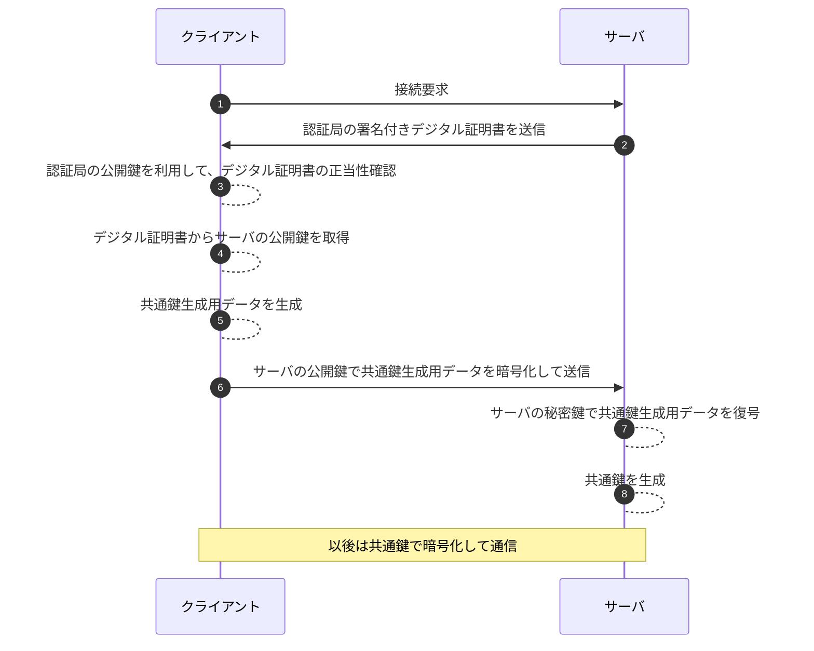
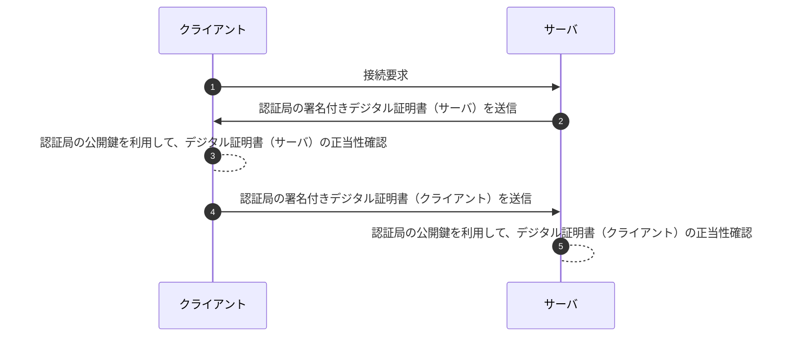

## DPop

### Proof of Possession

アクセストークンは電車の切符と同じで、落として他人に拾われると利用できてしまう。\
軽減策として、APIアクセス時に、アクセストークンに加えて本人と証明できる情報を提示させる（航空券 + パスポートが必要）手続きを `Proof of Possession`という。

### OAuth2.0 /OIDC文脈でのPoP

OAuth2.0/OIDC文脈では[RFC 8705](https://www.rfc-editor.org/rfc/rfc8705.html)に定義される`Mutual TLS（MTLS）`を利用する方法などがある。

- TLS通信で提示された**クライアント証明書**をトークン発行時に紐づけておく
- リソースサーバでアクセストークンを検証する際に、アクセストークンに紐づくクライアント証明書と実際に提示されたクライアント証明書の一致を確認する

---

### TLS通信の復習（基本情報）

まずは、一般的なTLS通信の確立を復習。

---

### MTLS

`Mutual TLS`ではクライアント側**も**証明書を送信して相互に認証する。

---

### OAuth2.0 / OIDC文脈でのMTLS

アクセストークン発行時にMTLSで取得したデジタル証明書（のハッシュ）をアクセストークンに紐づけておく。 \
リソースサーバがアクセストークンに紐づくデジタル証明書と突合し、本人確認する\
（アクセストークンが第三者に流出している場合、デジタル証明書が一致しない）。

---

### MTLSでのPoPの限界とDPoP

「クライアント証明書をクライアントアプリが持つ」必要がある。\
つまり、SPAなどではクライアント証明書を持つことができないため利用できない。\
そこで、DPoPという別の仕様が[RFC 9449](https://datatracker.ietf.org/doc/rfc9449/)に策定された。\
クライアント側で生成した**公開鍵**・**秘密鍵**を利用してPoPを行う。

