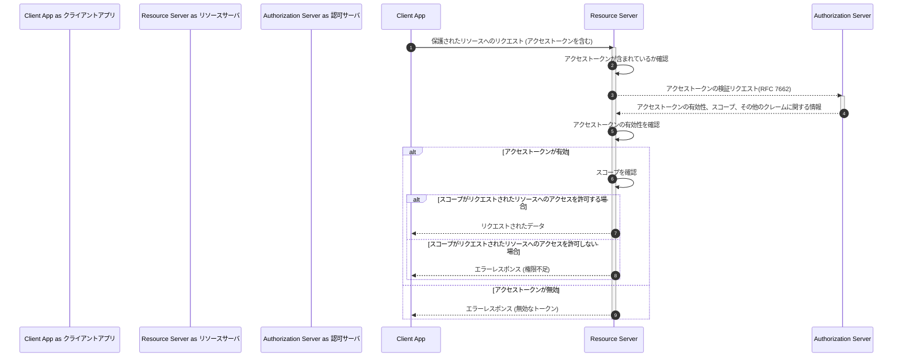

# 実際にアクセストークンを取得してみる

https://developers.google.com/oauthplayground/

---

# OAuth 2.0 実際のリクエスト例

実際のリクエスト例を見てみる（GoogleDriveを利用する場合[***]）。\
登場するパラメータの紹介もつけるが、詳細は[RFC 6749](https://datatracker.ietf.org/doc/html/rfc6749#section-4.1)を参照のこと。

[***]: https://developers.google.com/identity/protocols/oauth2/web-server?hl=ja#httprest

---

## 認可リクエスト

以下のURLにアクセスすることで認証・認可画面が表示され、ユーザに認証とリクエストする権限への同意（=認可）を得ることができる。

```
https://accounts.google.com/o/oauth2/v2/auth?
 scope=https%3A//www.googleapis.com/auth/drive.metadata.readonly%20https%3A//www.googleapis.com/auth/calendar.readonly&
 access_type=offline&
 response_type=code&
 state=state_parameter_passthrough_value&
 redirect_uri=https%3A//oauth2.example.com/code&
 client_id=1234567
```

---

### 認可リクエストの各パラメータについて

| パラメータ名  | 説明                                                       |
| :-----------: | :--------------------------------------------------------- |
|     scope     | 認可する権限範囲                                           |
| response_type | codeまたはtoken.認可コードグラントフローの場合は `code`    |
|     state     | 任意のランダムな文字列（役割については後述）               |
| redirect_uri  | リダイレクト先の指定（事前に登録しているものから一つ選ぶ） |
|   client_id   | クライアントアプリのID                                     |

---

## 認可の結果の返却

ユーザが同意する場合、しない場合、認証に失敗した場合のいずれの場合もクライアントアプリにリダイレクトする。
クエリパラメータに成否を表す値が付与される。

### 認可した場合

```
https://oauth2.example.com/auth?code=4/P7q7W91a-oMsCeLvIaQm6bTrgtp7
```

### 認可しなかった場合

```
https://oauth2.example.com/auth?error=access_denied
```

---

### リダイレクト時の各パラメータについて

| パラメータ名 | 説明                                       |
| :----------: | :----------------------------------------- |
|     code     | 認可コード（アクセストークンの発行に利用） |
|    error     | 認可が失敗した理由を表す文字列             |

---

## アクセストークン発行

クライアントアプリは認可コードを持ってアクセストークンを要求する。

```
POST /token HTTP/1.1
Host: oauth2.googleapis.com
Content-Type: application/x-www-form-urlencoded

code=4/P7q7W91a-oMsCeLvIaQm6bTrgtp7&
client_id=your_client_id&
client_secret=your_client_secret&
redirect_uri=https%3A//oauth2.example.com/code&
grant_type=authorization_code
```

---

### アクセストークン発行時の各パラメータについて

| パラメータ名  | 説明                                                |
| :-----------: | :-------------------------------------------------- |
|     code      | 認可コード                                          |
|   client_id   | クライアントアプリのID                              |
| client_secret | クライアントアプリのシークレット                    |
| redirect_uri  | リダイレクトURI（認可リクエスト時に利用したもの）   |
|  grant_type   | 認可コードグラントフローの場合 `authorization_code` |

---

## アクセストークンの返却

正常なリクエストの場合、以下のレスポンスを得る。

```json
{
  "access_token": "1/fFAGRNJru1FTz70BzhT3Zg",
  "expires_in": 3920,
  "token_type": "Bearer",
  "scope": "https://www.googleapis.com/auth/drive.metadata.readonly https://www.googleapis.com/auth/calendar.readonly",
  "refresh_token": "1//xEoDL4iW3cxlI7yDbSRFYNG01kVKM2C-259HOF2aQbI"
}
```

---

### レスポンスの各パラメータについて

| パラメータ名  | 説明                                       |
| :-----------: | :----------------------------------------- |
| access_token  | アクセストークン                           |
|  expires_in   | アクセストークンの有効期限(**秒**)         |
|  token_type   | トークンの種別                             |
|     scope     | 認可権限の範囲                             |
| refresh_token | アクセストークンを再発行するためのトークン |

---

## アクセストークンの利用・リソースサーバでの検証

クライアントアプリからリソースサーバへのリクエストの際にアクセストークンを付与してリクエストする。\
リソースサーバへのリクエストにアクセストークンを付与する仕様は[RFC 6750](https://datatracker.ietf.org/doc/html/rfc6750)に定められている（Authorizationヘッダーに埋め込むのが一般的）。 \
リソースサーバ側でアクセストークンの情報を取得するための仕様は[RFC 7662](https://datatracker.ietf.org/doc/html/rfc7662)に定められている。



---

### 検証リクエストで取得できる情報

アクセストークンの検証リクエストによって不透明なアクセストークンから以下の情報を得ることができる。

| 項目名     | 説明                               |
| :--------- | :--------------------------------- |
| sub        | ユーザ識別子                       |
| scope      | 許可したリソースの範囲を表す文字列 |
| expires_in | 有効期限                           |

---

### スコープについて

スコープは許可したリソースの範囲を指す文字列のこと。文字種などの指定はあるが、どのようなスコープにするかは認可サーバ・リソースサーバ実装者に委ねられている。\
以下、認可サーバのスコープ例をいくつか紹介する。

#### Googleの場合[**]

URIライクな文字列で定義されている（リソースへのアクセス許可というのを厳密にやっている）。

| スコープ名                                      | 説明                                                                                              |
| :---------------------------------------------- | :------------------------------------------------------------------------------------------------ |
| https://www.googleapis.com/auth/calendar        | Google カレンダーを使用してアクセスできるすべてのカレンダーの表示、編集、共有、完全削除を行えます |
| https://www.googleapis.com/auth/calendar.events | すべてのカレンダーの予定の表示と編集                                                              |
| https://mail.google.com/                        | Gmail のメールを閲覧、作成したり、Gmail からすべてのメールを完全に削除したりできます              |

[**]: https://developers.google.com/identity/protocols/oauth2/scopes?hl=ja

---

#### Slackの場合[***]

特定のリソースやそのサブリソースという形で定義している。

| スコープ名               | 説明                                                            |
| :----------------------- | :-------------------------------------------------------------- |
| admin                    | Administer a workspace                                          |
| admin.conversations:read | View the channel’s member list, topic, purpose and channel name |
| channels:join            | Join public channels in a workspace                             |

[***]: https://api.slack.com/scopes
