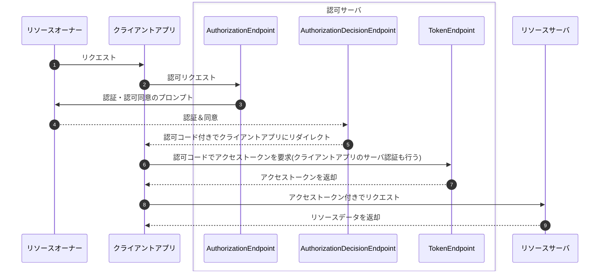

# OAuth 2.0 のプロトコルフロー

OAuth 2.0のフローには複数あるが[*]、代表的なAuthorization Code
Grantフロー（認可コードグラントフロー）について解説する。

[*]: https://qiita.com/TakahikoKawasaki/items/200951e5b5929f840a1f

---

## 認証・認可同意のプロンプトの具体例

Googleカレンダーを利用する場合。

