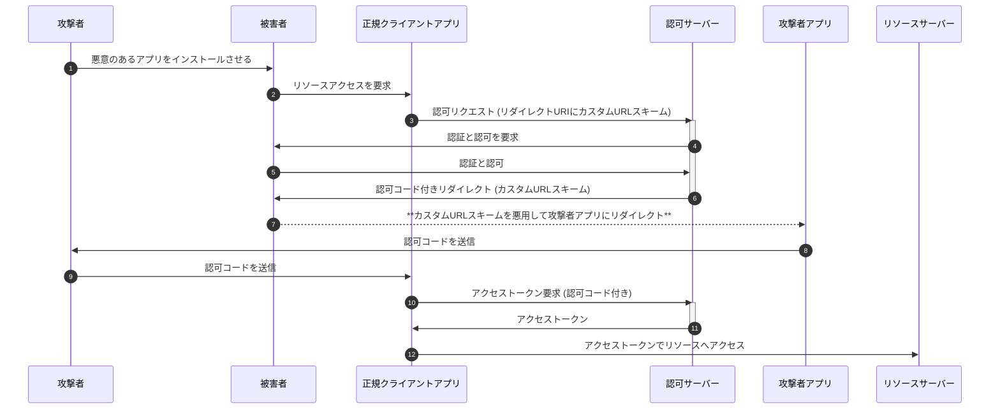
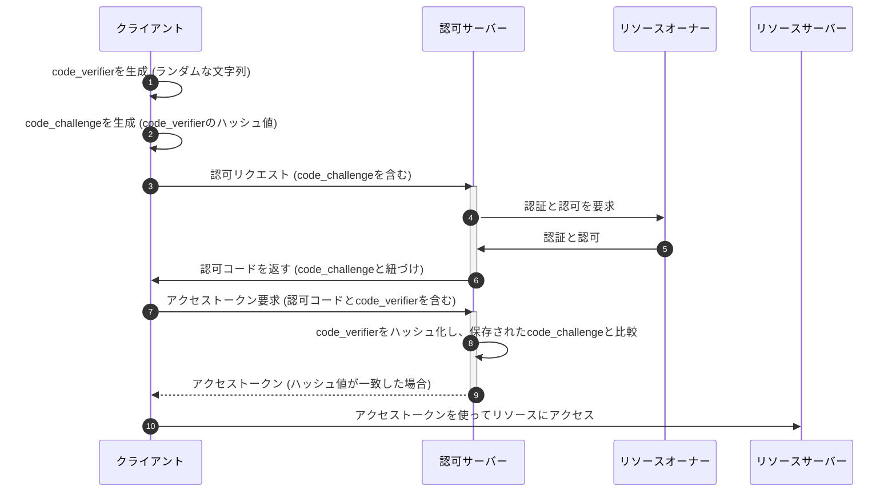
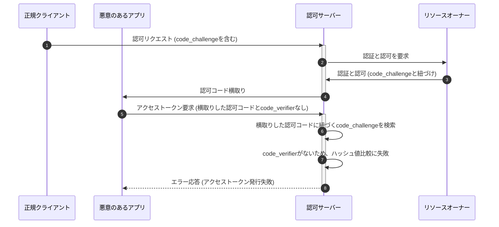
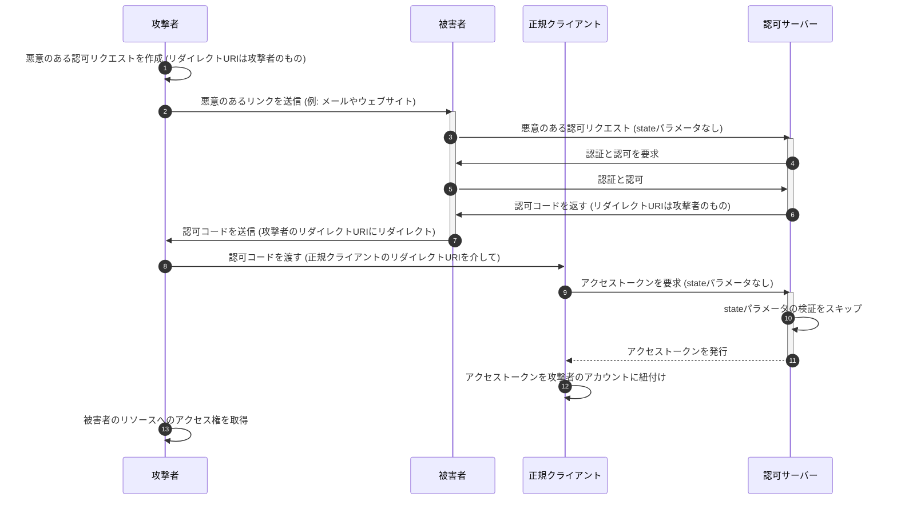
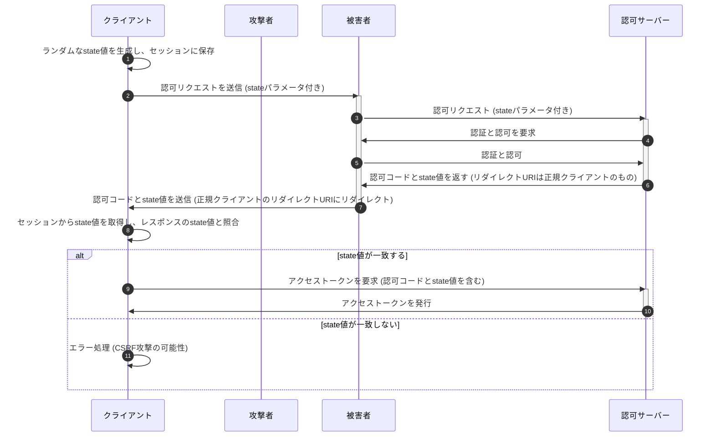
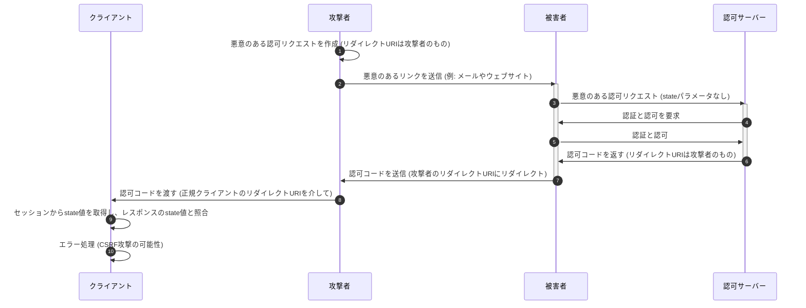

# OAuth 2.0 とセキュリティ

1. インプリシットフローの回避
2. PKCE (Proof Key for Code Exchange) の導入
3. stateの検証

---

# 1. インプリシットフローの回避

OAuth2.0の複数のプロトコルフローのうちインプリシットフローは非推奨とされている
(**OAuth2.0 Security Best Current Practice** や **OAuth 2.1**)。
インプリシットフローは認可コードではなくアクセストークンをリダイレクトを通じて直接クライアントアプリが受け取るフローであり、以下の観点から脆弱性が指摘されている。

- アクセストークンの漏洩：アクセストークンがブラウザの履歴やHTTPリファラーヘッダーに残るため、漏洩のリスクが高い。
- アクセストークンのリプレイ攻撃：漏洩したアクセストークンが悪意のある第三者によって使用される可能性がある。
- トークン置換攻撃への脆弱性：Implicitフローでは、認可サーバーはクライアントを認証しないため、トークン置換攻撃に対して脆弱である。

---

# 2. PKCE (Proof Key for Code Exchange) の導入

PKCEは、認可コード横取り攻撃を防止するためのセキュリティ機構。\
特に**PublicClient**で認可コードグラントフローを使用する場合には、PKCEの導入が必須。\
PKCEを使用することで、悪意のある第三者アプリケーションが認可コードを盗み出してアクセストークンを取得することを防ぐことができる。

---

# クライアントタイプ

PublicClientではクライアント認証しない。

- Confidential Client: クライアントシークレットを安全に管理できるクライアント
- Public Client:
  SPAやネイティブアプリなどクライアントシークレットを安全に管理できないクライアント

---

# ネイティブアプリで認可コードを横取りされるシーケンス

※カスタムURLスキーム： ネイティブのアプリをURL形式で指定する。複数のアプリ間でユニークで**なく**てよい。

---

# PKCE(Proof Key for Code Exchange)

code_verifierとcode_challengeによって、パブリッククライアントでも疑似的にクライアント認証する。

- code_verifier
  - クライアントアプリで都度生成するランダムな文字列
- code_challenge
  - code_verifierのハッシュ（SHA-265推奨）。**ハッシュなので code_challenge から code_verifier を復元することが難しい**。

---

# PKCE を導入した認可コードグラントフロー

---

# PKCE によって認可コード横取り攻撃を防ぐことができる理由

悪意のあるアプリは`code_verifier`を特定できないため、横取りはできてもアクセストークンを発行できない。

---

# 3. state パラメータの使用

- state
  - クライアントが認可リクエストを開始する際に生成するランダムな文字列で、リダイレクトURIを介してクライアントに返送される。
  - クライアントアプリ側で認可リクエスト時に生成した値をキャッシュしておき、リダイレクト時に認可サーバからの戻りとの一致を確認する。

---

# state を検証しない場合

攻撃者の作った認可リクエストを踏まされて、不正にアクセストークンを取得される。

---

# state を検証する認可コードグラントフロー

クライアントアプリはstateを発行して認可リクエストのパラメータとして付与する。リダイレクト時にキャッシュしたstateとリダイレクトのパラメータのstateを検証する。

---

# state の検証が CSRF を防ぐ理由

悪意のあるアプリはクライアントアプリが生成するstateをわからないため、クライアントアプリが必ずトークンを発行せずエラーとする。

