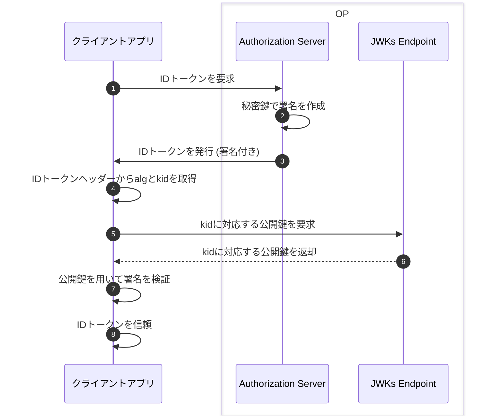

# ID トークンの構造とクレーム

続いて、認証情報の扱いの標準化についてIDトークンの仕組みを解説する。

---

## IDトークンの例

JSON Web Signature (JWS)の仕様に基づいた文字列のこと。以下が具体例。\
※見やすさのために改行を入れているだけで本来は改行なし。

```
eyJraWQiOiIxZTlnZGs3IiwiYWxnIjoiUlMyNTYifQ.ewogImlz
cyI6ICJodHRwOi8vc2VydmVyLmV4YW1wbGUuY29tIiwKICJzdWIiOiAiMjQ4
Mjg5NzYxMDAxIiwKICJhdWQiOiAiczZCaGRSa3F0MyIsCiAibm9uY2UiOiAi
bi0wUzZfV3pBMk1qIiwKICJleHAiOiAxMzExMjgxOTcwLAogImlhdCI6IDEz
MTEyODA5NzAsCiAibmFtZSI6ICJKYW5lIERvZSIsCiAiZ2l2ZW5fbmFtZSI6
ICJKYW5lIiwKICJmYW1pbHlfbmFtZSI6ICJEb2UiLAogImdlbmRlciI6ICJm
ZW1hbGUiLAogImJpcnRoZGF0ZSI6ICIwMDAwLTEwLTMxIiwKICJlbWFpbCI6
ICJqYW5lZG9lQGV4YW1wbGUuY29tIiwKICJwaWN0dXJlIjogImh0dHA6Ly9l
eGFtcGxlLmNvbS9qYW5lZG9lL21lLmpwZyIKfQ.rHQjEmBqn9Jre0OLykYNn
spA10Qql2rvx4FsD00jwlB0Sym4NzpgvPKsDjn_wMkHxcp6CilPcoKrWHcip
R2iAjzLvDNAReF97zoJqq880ZD1bwY82JDauCXELVR9O6_B0w3K-E7yM2mac
AAgNCUwtik6SjoSUZRcf-O5lygIyLENx882p6MtmwaL1hd6qn5RZOQ0TLrOY
u0532g9Exxcm-ChymrB4xLykpDj3lUivJt63eEGGN6DH5K6o33TcxkIjNrCD
4XB1CKKumZvCedgHHF3IAK4dVEDSUoGlH9z4pP_eWYNXvqQOjGs-rDaQzUHl
6cQQWNiDpWOl_lxXjQEvQ
```

---

# ID トークンの構造とクレーム

IDトークンはピリオド区切りで3つの部分からなる。

**ヘッダー.ペイロード.署名**

先の例だと以下の通り。

**ヘッダー**

```
eyJraWQiOiIxZTlnZGs3IiwiYWxnIjoiUlMyNTYifQ
```

---

**ペイロード**

```
ewogImlz
cyI6ICJodHRwOi8vc2VydmVyLmV4YW1wbGUuY29tIiwKICJzdWIiOiAiMjQ4
Mjg5NzYxMDAxIiwKICJhdWQiOiAiczZCaGRSa3F0MyIsCiAibm9uY2UiOiAi
bi0wUzZfV3pBMk1qIiwKICJleHAiOiAxMzExMjgxOTcwLAogImlhdCI6IDEz
MTEyODA5NzAsCiAibmFtZSI6ICJKYW5lIERvZSIsCiAiZ2l2ZW5fbmFtZSI6
ICJKYW5lIiwKICJmYW1pbHlfbmFtZSI6ICJEb2UiLAogImdlbmRlciI6ICJm
ZW1hbGUiLAogImJpcnRoZGF0ZSI6ICIwMDAwLTEwLTMxIiwKICJlbWFpbCI6
ICJqYW5lZG9lQGV4YW1wbGUuY29tIiwKICJwaWN0dXJlIjogImh0dHA6Ly9l
eGFtcGxlLmNvbS9qYW5lZG9lL21lLmpwZyIKfQ
```

**署名**

```
rHQjEmBqn9Jre0OLykYNn
spA10Qql2rvx4FsD00jwlB0Sym4NzpgvPKsDjn_wMkHxcp6CilPcoKrWHcip
R2iAjzLvDNAReF97zoJqq880ZD1bwY82JDauCXELVR9O6_B0w3K-E7yM2mac
AAgNCUwtik6SjoSUZRcf-O5lygIyLENx882p6MtmwaL1hd6qn5RZOQ0TLrOY
u0532g9Exxcm-ChymrB4xLykpDj3lUivJt63eEGGN6DH5K6o33TcxkIjNrCD
4XB1CKKumZvCedgHHF3IAK4dVEDSUoGlH9z4pP_eWYNXvqQOjGs-rDaQzUHl
6cQQWNiDpWOl_lxXjQEvQ
```

となる。

---

# ID トークンの構造とクレーム

ヘッダー、ペイロード、署名のそれぞれに含まれる情報配下の通り。

- ヘッダー (Header): JWTのタイプや署名アルゴリズムなどの情報
- ペイロード (Payload): 認証に関する情報（クレーム）
- 署名 (Signature): トークンの改ざんを検知するための情報

---

# ID トークンの構造とクレーム

**ヘッダー.ペイロード.署名**という3つのパーツに分ける形式がJWSに定義される**Compact Serialization 形式**。\
具体的には以下のように定義されている。

> BASE64URL(UTF8(JWS Protected Header)) || '.' || \
> BASE64URL(JWS Payload) || '.' || \
> BASE64URL(JWS Signature)

つまり、Base64エンコードされている（デコードすることで元の情報を得られる）ということ。

---

# ID トークンの構造とクレーム

## ヘッダーのデコード

```sh
echo -n 'eyJraWQiOiIxZTlnZGs3IiwiYWxnIjoiUlMyNTYifQ==' |  base64 -di # paddingのため==を追加
```

```json
{ "kid": "1e9gdk7", "alg": "RS256" }
```

JSON形式でkidとalgというパラメータが含まれていることが分かる。

---

ヘッダーは具体的には以下のパラメータを持ちうる。

| パラメーター名 |      説明      |
| :------------: | :------------: |
|      alg       |  アルゴリズム  |
|      jku       | JWK セット URL |
|      jwk       | JSON Web キー  |
|      kid       |    キー ID     |
|      x5u       |   X.509 URL    |

---

| パラメーター名 |              説明               |
| :------------: | :-----------------------------: |
|      x5c       |      X.509 証明書チェーン       |
|      x5t       |  X.509 証明書 SHA-1 Thumbprint  |
|    x5t#S256    | X.509 証明書 SHA-256 Thumbprint |
|      typ       |    JWS 自身のメディアタイプ     |
|      cty       |   ペイロードのメディアタイプ    |
|      crit      |     必須パラメーター群指定      |

---

# ID トークンの構造とクレーム

## ペイロードのデコード

```sh
echo -n 'ewogImlzcyI6ICJodHRwOi8vc2VydmVyLmV4YW1wbGUuY29tIiwKICJzdWIiOiAiMjQ4 \
Mjg5NzYxMDAxIiwKICJhdWQiOiAiczZCaGRSa3F0MyIsCiAibm9uY2UiOiAi \
bi0wUzZfV3pBMk1qIiwKICJleHAiOiAxMzExMjgxOTcwLAogImlhdCI6IDEz \
MTEyODA5NzAsCiAibmFtZSI6ICJKYW5lIERvZSIsCiAiZ2l2ZW5fbmFtZSI6 \
ICJKYW5lIiwKICJmYW1pbHlfbmFtZSI6ICJEb2UiLAogImdlbmRlciI6ICJm \
ZW1hbGUiLAogImJpcnRoZGF0ZSI6ICIwMDAwLTEwLTMxIiwKICJlbWFpbCI6 \
ICJqYW5lZG9lQGV4YW1wbGUuY29tIiwKICJwaWN0dXJlIjogImh0dHA6Ly9l \
eGFtcGxlLmNvbS9qYW5lZG9lL21lLmpwZyIKfQ==' |  base64 -di
```

---

```json
{
  "iss": "http://server.example.com",
  "sub": "248289761001",
  "aud": "s6BhdRkqt3",
  "nonce": "n-0S6_WzA2Mj",
  "exp": 1311281970,
  "iat": 1311280970,
  "name": "Jane Doe",
  "given_name": "Jane",
  "family_name": "Doe",
  "gender": "female",
  "birthdate": "0000-10-31",
  "email": "janedoe@example.com",
  "picture": "http://example.com/janedoe/me.jpg"
}
```

上記のようにユーザ情報などが得られていることがわかる（詳細は後述）。

---

# ID トークンの構造とクレーム

## 署名のデコード

署名は、トークンの改ざんがされていないことを確認するための情報。 \
デコードすると以下のバイナリが得られる。

```sh
echo -n 'rHQjEmBqn9Jre0OLykYNn \
spA10Qql2rvx4FsD00jwlB0Sym4NzpgvPKsDjn_wMkHxcp6CilPcoKrWHcip \
R2iAjzLvDNAReF97zoJqq880ZD1bwY82JDauCXELVR9O6_B0w3K-E7yM2mac \
AAgNCUwtik6SjoSUZRcf-O5lygIyLENx882p6MtmwaL1hd6qn5RZOQ0TLrOY \
u0532g9Exxcm-ChymrB4xLykpDj3lUivJt63eEGGN6DH5K6o33TcxkIjNrCD \
4XB1CKKumZvCedgHHF3IAK4dVEDSUoGlH9z4pP_eWYNXvqQOjGs-rDaQzUHl \
6cQQWNiDpWOl_lxXjQEvQ==' \
| base64 -di \
| od -tu1 -An
```

---

```
 172 116  35  18  96 106 159 210 107 123  67 139 202  70  13 158
 202  64 215  68  42 151 106 239 199 129 108  15  77  35 194  80
 116  75  41 184  55  58  96 188 242 172  14  57 240  50  65 241
 114 158 130 138  83 220 160 170 214  29 200 169  71 104 128 143
  50 239  12 208  17 120  95 123 206 130 106 171 207  52 100  61
  91 193 143  54  36  54 174   9 113  11  85  31  78 232  29  48
 220 161  59 200 205 166 105 192   0 128 208 148 194 216 164 233
  40 232  73  70  81 113 243 185 151  40   8 200 177  13 199 207
  54 167 163  45 155   6 139 214  23 122 170 126  81 100 228  52
  76 186 206  98 237  57 223 104  61  19  28  92 152  40 114 154
 176 120 196 188 164 164  56 247 149  72 175  38 222 183 120  65
 134  55 160 199 228 174 168 223 116 220 198  66  35  54 176 131
 225 112 117   8 162 174 153 155 194 121 216   7  28  93 200   0
 174  29  84  64 210  82 129 165  31 220 248 164 247 150  96 213
 239 169   3 163  26 202 195 105  12 212  30  94 156  65   5 141
 136  58  86  58  89 113  94  52   4 189
```

---

# ID トークンの構造とクレーム

## 署名検証

署名は**ヘッダーとペイロード**を入力情報に作成される。今までの例だと以下が入力情報。

```
eyJraWQiOiIxZTlnZGs3IiwiYWxnIjoiUlMyNTYifQ.ewogImlz
cyI6ICJodHRwOi8vc2VydmVyLmV4YW1wbGUuY29tIiwKICJzdWIiOiAiMjQ4
Mjg5NzYxMDAxIiwKICJhdWQiOiAiczZCaGRSa3F0MyIsCiAibm9uY2UiOiAi
bi0wUzZfV3pBMk1qIiwKICJleHAiOiAxMzExMjgxOTcwLAogImlhdCI6IDEz
MTEyODA5NzAsCiAibmFtZSI6ICJKYW5lIERvZSIsCiAiZ2l2ZW5fbmFtZSI6
ICJKYW5lIiwKICJmYW1pbHlfbmFtZSI6ICJEb2UiLAogImdlbmRlciI6ICJm
ZW1hbGUiLAogImJpcnRoZGF0ZSI6ICIwMDAwLTEwLTMxIiwKICJlbWFpbCI6
ICJqYW5lZG9lQGV4YW1wbGUuY29tIiwKICJwaWN0dXJlIjogImh0dHA6Ly9l
eGFtcGxlLmNvbS9qYW5lZG9lL21lLmpwZyIKfQ
```

ヘッダーで指定されたアルゴリズム（上記の場合RS256）に基づいて「ヘッダーとペイロード」を暗号化したバイナリをbase64エンコードしていた。

---

# ID トークンの構造とクレーム

## 署名検証

例えば、RS256の場合、以下のようなシーケンスで署名検証を行う。\
**JWKs Endpoint**は暗号鍵を扱うエンドポイント。暗号鍵をJSON形式で扱う[JWK](https://datatracker.ietf.org/doc/html/rfc7517)も参照のこと。



---

# ID トークンの構造とクレーム

## ペイロードのクレーム

JWT（JSON形式で表現されたクレーム（claim）の集合）がペイロードに埋め込まれている。

以下は先のdecode例。

```json
{
  "iss": "http://server.example.com",
  "sub": "248289761001",
  "aud": "s6BhdRkqt3",
  "nonce": "n-0S6_WzA2Mj",
  "exp": 1311281970,
  "iat": 1311280970,
  "name": "Jane Doe",
  "given_name": "Jane",
  "family_name": "Doe",
  "gender": "female",
  "birthdate": "0000-10-31",
  "email": "janedoe@example.com",
  "picture": "http://example.com/janedoe/me.jpg"
}
```

---

# ID トークンの構造とクレーム

## ペイロードのクレーム

<!-- textlint-disabled max-comma -->

[JWTの仕様](https://datatracker.ietf.org/doc/html/rfc7519)では、以下のクレームが定義されている。

<!-- textlint-enabled max-comma -->

OIDCでは、そのうち、`iss`、 `sub`、 `aud`、 `exp`、 `iat`を必須としている（JWTの仕様では全て任意）。

| クレーム名 |                     説明                     |
| :--------: | :------------------------------------------: |
|    iss     | JWT の発行者 (issuer) を識別するための識別子 |
|    sub     |             ユーザーの一意識別子             |
|    aud     |              Audience クレーム               |

---

| クレーム名 |                         説明                          |
| :--------: | :---------------------------------------------------: |
|    exp     |   JWT の有効期限。Unix エポック からの経過**秒**数    |
|    nbf     |                  Not Before クレーム                  |
|    iat     | JWT が発行された日時。Unix エポックからの経過**秒**数 |
|    jti     |                    JWT ID クレーム                    |

---

# ID トークンの構造とクレーム

## ペイロードのクレーム

加えてJWTとは別でOIDCの仕様として定義されるクレームも存在する。

| クレーム名 |                                     説明                                     |
| :--------: | :--------------------------------------------------------------------------: |
| auth_time  |          ユーザーが認証された時刻。Unix エポックからの経過**秒**数           |
|   nonce    | リプレイアタック防止のためのパラメータ。リクエストされた値をそのまま埋め込む |
|    acr     |                ユーザー認証が満たした認証コンテキストのクラス                |
|    amr     |                      認証手法。利用者が規則決めて運用。                      |
|    azp     |              認可された対象者(認可されたクライアントアプリのID)              |

---

# ID トークンの構造とクレーム

## ペイロードのクレーム

ユーザ情報を表すクレームもOIDCにて定義されている。

| クレーム名  |         説明         |
| :---------: | :------------------: |
|     sub     | ユーザーの一意識別子 |
|    name     |      フルネーム      |
| given_name  |          名          |
| family_name |          姓          |
| middle_name |     ミドルネーム     |
|  nickname   |     ニックネーム     |

---

|     クレーム名     |                  説明                  |
| :----------------: | :------------------------------------: |
| preferred_username |            好みのユーザー名            |
|      profile       |        プロフィールページの URL        |
|      picture       |         プロフィール画像の URL         |
|      website       |        Web サイトやブログの URL        |
|       email        |             メールアドレス             |
|   email_verified   | メールアドレスが検証済みか否かの真偽値 |
|       gender       |   性別。female と male が定義済み。    |
|     birthdate      |    誕生日。YYYY-MM-DD という書式。     |
|      zoneinfo      |   タイムゾーン。Europe/Paris など。    |

---

|      クレーム名       |                     説明                      |
| :-------------------: | :-------------------------------------------: |
|        locale         |            ロケール。en-US など。             |
|     phone_number      |                   電話番号                    |
| phone_number_verified |       電話番号が検証済みか否かの真偽値        |
|        address        | 住所。書式は「5.1.1. Address Claim」に記載。  |
|      updated_at       | 最終更新日。Unix エポックからの経過**秒**数。 |

---

# ID トークンの構造とクレーム

## ペイロードのクレーム

アクセストークンの発行を同時に行うときには以下のクレームを追加する。

| クレーム名 |                                        説明                                         |
| :--------: | :---------------------------------------------------------------------------------: |
|  at_hash   | アクセストークンのハッシュのうち、左半分のビット群を base64url でエンコードしたもの |
|   c_hash   |   認可コードのハッシュのうち、 左半分のビット群を base64url でエンコードしたもの    |

また、`nonce`が必須となる。
