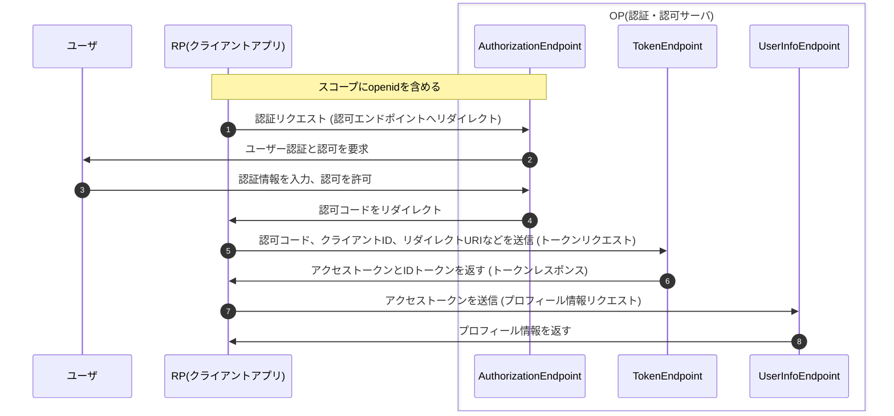

# OpenID Connectのフロー

OAuth2.0の認可エンドポイントには必須パラメータとして`response_type`があるが、OIDCではこの仕様を拡張した。

- OAuth2.0
  - `code`か`token`の**いずれか**の値を取る
- OIDC
  - `code`、`token`、`id_token`の**任意の組み合わせ** + `none`

---

したがってOIDCでは、以下のパターンの`response_type`を取りうることになる。

- code
- token
- id_token
- id_token token
- code id_token
- code token
- code id_token token
- none

また、IDトークンの発行を受けるためには`scope`に`openid`を含める必要がある。

`response_type`を適切に指定することで、認可エンドポイントやトークンエンドポイントからIDトークンを得ることができる。\
全フローの解説については[こちら](https://qiita.com/TakahikoKawasaki/items/4ee9b55db9f7ef352b47)を参照のこと。

---

# OpenID Connectのフロー

OAuth2.0のアクセストークンの発行と同時にIDトークンを発行することも可能。以下は認可コードグラントフローの場合。

