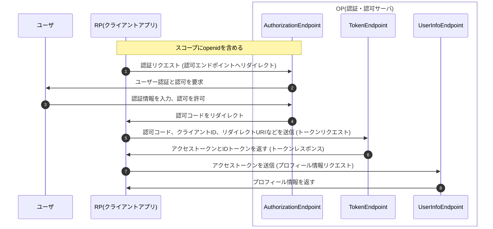

# OpenID Connectのフロー

以下のように、認証情報を扱うIDトークンの発行をする。

---

# OpenID Connectのフロー

IDトークンには偽装防止のために署名をつける。

---

# OpenID Connectのフロー

OAuth2.0のアクセストークンの発行と同時にIDトークンを発行することも可能。以下は認可コードグラントフローの場合。

---

# OpenID Connectのフロー

詳細なシーケンスは以下のようになる。

