# OAuth2.0/OIDC概説

<!-- paginate: skip -->

# アジェンダ

1. 認可と認証
2. OAuth 2.0
3. OpenID Connect (OIDC)
4. OAuth 2.0 と OIDC の応用

<!-- paginate: true -->

# アジェンダ

1. **認可と認証**
2. OAuth 2.0
3. OpenID Connect (OIDC)
4. OAuth 2.0 と OIDC の応用

# 1. 認可と認証

- **認証** と **認可** の違いについて
- 従来の認証方式における課題

<!-- header: 1. 認可と認証 -->

# **認証** と **認可** の違いについて

- 認証(Authentication)
  - ユーザーの身元を確認すること(私は～～です)
- 認可(Authorization)
  - ユーザーにリソースにアクセスする許可を与えること(～～をしてよいです)

# OAuth2.0/OIDCの文脈に寄せた具体例

- 認証(Authentication)
  - ○○としてログインする
- 認可(Authorization)
  - ○○の代わりに「写真を閲覧してもよい」「写真をアップロードしてよい」「写真を削除してよい」

# 従来の認証方式における課題

1. パスワードの共有
   - 第三者サービスを利用するために、ユーザーは自分のパスワードをそのサービスに提供する必要があった
2. 各サービスごとに認証が必要
   - 多くのウェブサイトやサービスで、ユーザーは個別にアカウントを作成し、パスワードを管理する必要があった

# 従来の認証方式

従来認証方式ではクライアントがサーバに向けてID/Passwordを入力しユーザのデータにアクセス


# パスワードの共有

そのため、3rdパーティのアプリがユーザのデータにアクセスするためには、ID/Password(に類する情報)を共有する必要


# 各サービスごとに認証が必要

また、サービスごとにIDが管理されているため、ユーザは複数のIDを管理する必要があった



# アジェンダ

1. 認可と認証
2. **OAuth 2.0**
3. OpenID Connect (OIDC)
4. OAuth 2.0 と OIDC の応用

<!-- header: 2. OAuth 2.0 -->

# OAuth 2.0

1. OAuth 2.0 の基本的な概念と登場人物
   (リソースオーナー、リソースサーバー、クライアントアプリ、認可サーバー)
2. OAuth 2.0 のプロトコルフロー
   (認可リクエスト、認可グラント、アクセストークン発行) について
3. OAuth 2.0が従来の認証方式の抱える課題を如何に解決したか？

# OAuth 2.0 の基本的な概念と登場人物

ここからはOAuthの仕様を解説していくので用語を整理...

<style scoped>
table {margin-left: auto; margin-right: auto;table-layout: fixed;width: 90%; display:table; font-size: 24px}
thead th {text-align: center !important;}
thead tr {background: #eaeaea;}
tbody tr:nth-child(2n+1) {background: #fff;}
tbody tr:nth-child(2n) {background: #dde5d3;}
</style>

| 用語               | 説明                             | さっきまでの用語  |
| :----------------- | :------------------------------- | :---------------- |
| リソースオーナー   | リソースを所有している人         | ユーザ            |
| リソースサーバ     | リソースを管理するサーバ         | サーバ・アプリ    |
| クライアントアプリ | 認可サーバにとってのクライアント | 3rdパーティアプリ |
| 認可サーバ         | 認可を扱うサーバ                 | :new:             |
| アクセストークン   | 認可の証明 <br/>（実体は文字列） | :new:             |
| スコープ           | 許可する権限の範囲               | :new:             |

# OAuth 2.0 の基本的な概念と登場人物

図にするとこんな感じ...


事前に認可サーバへのリクエストを通じて「クライアントアプリに特定の操作を許可する」というフローを追加した！

# OAuth 2.0 のプロトコルフロー

OAuth 2.0のフローには4種類あるが[*]、今回は代表的な Authorization Code
Grantフロー(認可コードグラントフロー)について解説


[*]: https://qiita.com/TakahikoKawasaki/items/200951e5b5929f840a1f

# OAuth 2.0 のプロトコルフロー

実際のリクエスト例を見てみる（GoogleDriveを利用する場合[***]）。

[***]: https://developers.google.com/identity/protocols/oauth2/web-server?hl=ja#httprest

# 認可リクエスト

以下のURLにアクセスすることで認証・認可画面が表示され、ユーザに認証とリクエストする権限への同意(=認可)を得ることができる.

```
https://accounts.google.com/o/oauth2/v2/auth?
 scope=https%3A//www.googleapis.com/auth/drive.metadata.readonly%20https%3A//www.googleapis.com/auth/calendar.readonly&
 access_type=offline&
 include_granted_scopes=true&
 response_type=code&
 state=state_parameter_passthrough_value&
 redirect_uri=https%3A//oauth2.example.com/code&
 client_id=1234567
```

# 認可の結果の返却

ユーザが同意する場合、しない場合、認証に失敗した場合のいずれの場合もクライアントアプリにリダイレクトする。
クエリパラメータに成否に伴って値が付与される。

## 認可した場合

```
https://oauth2.example.com/auth?code=4/P7q7W91a-oMsCeLvIaQm6bTrgtp7
```

## 認可しなかった場合

```
https://oauth2.example.com/auth?error=access_denied
```

# アクセストークン発行

クライアントアプリは認可コードを持ってアクセストークンを要求する。

```
POST /token HTTP/1.1
Host: oauth2.googleapis.com
Content-Type: application/x-www-form-urlencoded

code=4/P7q7W91a-oMsCeLvIaQm6bTrgtp7&
client_id=your_client_id&
client_secret=your_client_secret&
redirect_uri=https%3A//oauth2.example.com/code&
grant_type=authorization_code
```

# アクセストークンの返却

正常なリクエストの場合、以下のレスポンスを得る

```json
{
    "access_token": "1/fFAGRNJru1FTz70BzhT3Zg",
    "expires_in": 3920,
    "token_type": "Bearer",
    "scope": "https://www.googleapis.com/auth/drive.metadata.readonly https://www.googleapis.com/auth/calendar.readonly",
    "refresh_token": "1//xEoDL4iW3cxlI7yDbSRFYNG01kVKM2C-259HOF2aQbI"
}
```

# OAuth 2.0が従来の認証方式の抱える課題を如何に解決したか？

パスワードをクライアントアプリに共有する必要がなくなった。

> 保護されたリソースにアクセスする為にリソースオーナーのクレデンシャルを使う代わりに,クライアントはアクセストークンを取得する.
> アクセストークンとは,ある特定のスコープ,期間およびその他のアクセス権に関する情報を示す文字列である.
> アクセストークンはリソースオーナーの同意をもって認可サーバーからサードパーティークライアントへ発行される.クライアントはアクセストークンを用いてリソースサーバーがホストしている保護されたリソースにアクセスする.[**]

[**]: https://openid-foundation-japan.github.io/rfc6749.ja.html

# 具体的にOAuth2.0の仕様を見ると...

> 従来のクライアントサーバー型の認証モデルでは,
> クライアントはリソースオーナーのクレデンシャルを使ってサーバーに対して認証を行い,
> サーバー上の保護されたリソースにアクセスする. つまり,
> サードパーティーアプリケーションに保護されたリソースへのアクセス権を与えるには,
> リソースオーナーは自身のクレデンシャルをサードパーティーと共有する必要がある.
> これはいくつかの問題と制限をもたらす.

# 参考文献

- [RFC6749](https://openid-foundation-japan.github.io/rfc6749.ja.html)
- [OpenID Connect Core 1.0 incorporating errata set 1](https://openid-foundation-japan.github.io/openid-connect-core-1_0.ja.html)
- [一番分かりやすい OAuth の説明](https://qiita.com/TakahikoKawasaki/items/e37caf50776e00e733be)
- [一番分かりやすい OpenID Connect の説明](https://qiita.com/TakahikoKawasaki/items/498ca08bbfcc341691fe)
- [PKCE: 認可コード横取り攻撃対策のために OAuth サーバーとクライアントが実装すべきこと](https://qiita.com/TakahikoKawasaki/items/00f333c72ed96c4da659)
- [OAuth/OIDCをまとめてみる(下書き段階です！)](https://zenn.dev/calloc134/articles/5e8da6c491e720)

# Appendix

# なぜわざわざ認可コードを利用するのか...

https://developers.google.com/identity/protocols/oauth2/web-server?hl=ja#httprest

# トークン発行に伴ってクライアントシークレットというパラメータがあるが、SPAやネイティブアプリの場合どうなるのか？

https://developers.google.com/identity/protocols/oauth2/web-server?hl=ja#httprest

# 各種攻撃に対する対策

- PKCE
- stateの検証