# OAuth2.0/OIDC 概説

---

# アジェンダ

1. 認可と認証
2. OAuth 2.0
3. OpenID Connect (OIDC)
4. OAuth 2.0 と OIDC の応用

---

# アジェンダ

1. **認可と認証**
2. OAuth 2.0
3. OpenID Connect (OIDC)
4. OAuth 2.0 と OIDC の応用

---

# 1. 認可と認証

- **認証** と **認可** の違いについて
- 従来の認証方式における課題

---

# **認証** と **認可** の違いについて

- 認証(Authentication)
  - ユーザーの身元を確認すること(私は～～です)
- 認可(Authorization)
  - ユーザーにリソースにアクセスする許可を与えること(～～をしてよいです)

---

# OAuth2.0/OIDC の文脈に寄せた具体例

- 認証(Authentication)
  - ○○ としてログインする
- 認可(Authorization)
  - ○○ の代わりに「写真を閲覧してもよい」「写真をアップロードしてよい」「写真を削除してよい」

---

# 従来の認証方式における課題

1. パスワードの共有
   - 第三者サービスを利用するために、ユーザーは自分のパスワードをそのサービスに提供する必要があった
2. 各サービスごとに認証が必要
   - 多くのウェブサイトやサービスで、ユーザーは個別にアカウントを作成し、パスワードを管理する必要があった

---

# 従来の認証方式

従来認証方式ではクライアントがサーバに向けて ID/Password を入力しユーザのデータにアクセス


---

# パスワードの共有

そのため、3rd パーティのアプリがユーザのデータにアクセスするためには、ID/Password(に類する情報)を共有する必要


---

# 各サービスごとに認証が必要

また、サービスごとに ID が管理されているため、ユーザは複数の ID を管理する必要があった


---

# アジェンダ

1. 認可と認証
2. **OAuth 2.0**
3. OpenID Connect (OIDC)
4. OAuth 2.0 と OIDC の応用

---

# OAuth 2.0

**OAuth 2.0** =
リソース所有者が自身の所有するリソースへのアクセス権を第三者アプリケーションに安全に委任するための認可フレームワーク。\
様々な仕様が RFC などに定義されている。

---

# OAuth 2.0

1. OAuth 2.0 の基本的な概念と登場人物
   (リソースオーナー、リソースサーバー、クライアントアプリ、認可サーバー)
2. OAuth 2.0 のプロトコルフロー
3. OAuth 2.0 が従来の認証方式の抱える課題を如何に解決したか？
4. OAuth 2.0 実際のリクエスト例
5. OAuth 2.0 とセキュリティ （インプリシットフロー非推奨、PKCE、state 検証）
6. トークンの再発行、検証、取り消し

---

# OAuth 2.0 の基本的な概念と登場人物

ここからは OAuth の仕様を解説していくので用語を整理...

- アクセストークン: 保護されたリソースにアクセスするための鍵
- リソースオーナー: リソースの所有者（例: Google Photo のユーザー）
- クライアントアプリ:
  リソースにアクセスしたい第三者アプリケーション（認可サーバ目線だとクライアント）
- リソースサーバー: リソースを保管しているサーバー
- 認可サーバー:アクセストークンを発行するサーバー
- 認可グラント:アクセストークンを取得するための方法
- スコープ: リソースへのアクセス範囲

---

# OAuth 2.0 の基本的な概念と登場人物

図にするとこんな感じ...


事前に認可サーバへのリクエストを通じて「クライアントアプリに特定の操作を許可する」というフローを追加した！

---

# OAuth 2.0 のプロトコルフロー

OAuth 2.0 のフローには複数あるが[*]、代表的な Authorization Code
Grant フロー(認可コードグラントフロー)について解説

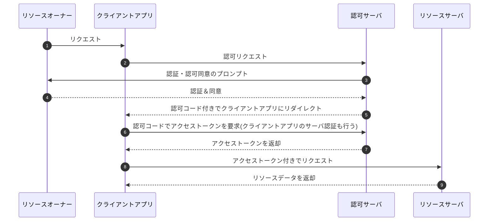

[*]: https://qiita.com/TakahikoKawasaki/items/200951e5b5929f840a1f

---

# OAuth 2.0 が従来の認証方式の抱える課題を如何に解決したか？

パスワードをクライアントアプリに共有する必要がなくなった。\
= パスワードではなくアクセストークンを 3rd パーティのアプリは利用する。

> 保護されたリソースにアクセスする為にリソースオーナーのクレデンシャルを使う代わりに,クライアントはアクセストークンを取得する.
> **アクセストークンとは,ある特定のスコープ,期間およびその他のアクセス権に関する情報を示す文字列**である.[**]

[**]: https://openid-foundation-japan.github.io/rfc6749.ja.html

---

# OAuth 2.0 実際のリクエスト例

実際のリクエスト例を見てみる（GoogleDrive を利用する場合[***]）。

[***]: https://developers.google.com/identity/protocols/oauth2/web-server?hl=ja#httprest

---

# 認可リクエスト

以下の URL にアクセスすることで認証・認可画面が表示され、ユーザに認証とリクエストする権限への同意(=認可)を得ることができる.

```
https://accounts.google.com/o/oauth2/v2/auth?
 scope=https%3A//www.googleapis.com/auth/drive.metadata.readonly%20https%3A//www.googleapis.com/auth/calendar.readonly&
 access_type=offline&
 include_granted_scopes=true&
 response_type=code&
 state=state_parameter_passthrough_value&
 redirect_uri=https%3A//oauth2.example.com/code&
 client_id=1234567
```

---

# 認可の結果の返却

ユーザが同意する場合、しない場合、認証に失敗した場合のいずれの場合もクライアントアプリにリダイレクトする。
クエリパラメータに成否に伴って値が付与される。

## 認可した場合

```
https://oauth2.example.com/auth?code=4/P7q7W91a-oMsCeLvIaQm6bTrgtp7
```

## 認可しなかった場合

```
https://oauth2.example.com/auth?error=access_denied
```

---

# アクセストークン発行

クライアントアプリは認可コードを持ってアクセストークンを要求する。

```
POST /token HTTP/1.1
Host: oauth2.googleapis.com
Content-Type: application/x-www-form-urlencoded

code=4/P7q7W91a-oMsCeLvIaQm6bTrgtp7&
client_id=your_client_id&
client_secret=your_client_secret&
redirect_uri=https%3A//oauth2.example.com/code&
grant_type=authorization_code
```

---

# アクセストークンの返却

正常なリクエストの場合、以下のレスポンスを得る

```json
{
  "access_token": "1/fFAGRNJru1FTz70BzhT3Zg",
  "expires_in": 3920,
  "token_type": "Bearer",
  "scope": "https://www.googleapis.com/auth/drive.metadata.readonly https://www.googleapis.com/auth/calendar.readonly",
  "refresh_token": "1//xEoDL4iW3cxlI7yDbSRFYNG01kVKM2C-259HOF2aQbI"
}
```

---

# OAuth 2.0 とセキュリティ

1. インプリシットフローの回避
2. PKCE (Proof Key for Code Exchange) の導入
3. state の検証

---

# 1. インプリシットフローの回避

OAuth2.0 の複数のプロトコルフローのうちインプリシットフローは非推奨とされている
(**OAuth2.0 Security Best Current Practice** や **OAuth 2.1**)。
インプリシットフローは認可コードではなくアクセストークンをリダイレクトを通じて直接クライアントアプリが受け取るフローであり、以下の観点から脆弱性が指摘されている。

- アクセストークンの漏洩:アクセストークンがブラウザの履歴や HTTP リファラーヘッダーに残るため、漏洩のリスクが高い。
- アクセストークンのリプレイ攻撃:漏洩したアクセストークンが悪意のある第三者によって使用される可能性がある。
- トークン置換攻撃への脆弱性:Implicit フローでは、認可サーバーはクライアントを認証しないため、トークン置換攻撃に対して脆弱である。

---

# 2. PKCE (Proof Key for Code Exchange) の導入

PKCE は、認可コード横取り攻撃を防止するためのセキュリティ機構です。\
特に**PublicClient**で認可コードグラントフローを使用する場合には、PKCE の導入が必須\
PKCE を使用することで、悪意のある第三者アプリケーションが認可コードを盗み出してアクセストークンを取得することを防ぐことができる。

---

# クライアントタイプ

PublicClient ではクライアント認証を行わない。

- Confidential Client: クライアントシークレットを安全に管理できるクライアント
- Public Client:
  SPA やネイティブアプリなどクライアントシークレットを安全に管理できないクライアント

---

# ネイティブアプリで認可コードを横取りされるシーケンス

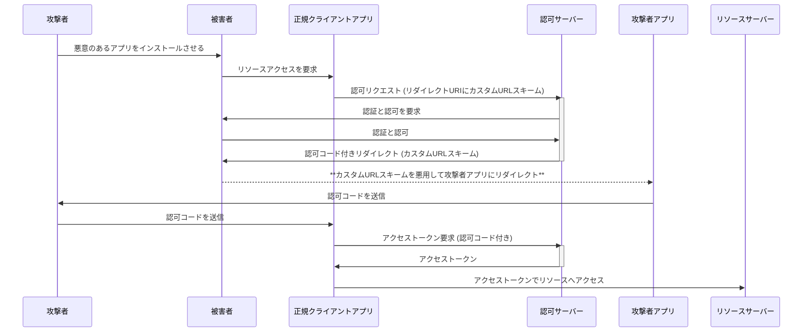

※カスタム URL スキーム: ネイティブのアプリを URL 形式で指定する。複数のアプリ間でユニークで**なく**てよい

---

# PKCE(Proof Key for Code Exchange)

code_verifier と code_challenge によって、パブリッククライアントでも疑似的にクライアント認証を行う。

- code_verifier
  - クライアントアプリで都度生成するランダムな文字列
- code_challenge
  - code_verifier のハッシュ(SHA-265 推奨)。**ハッシュなので code_challenge から code_verifier を復元することが難しい**。

---

# PKCE を導入した認可コードグラントフロー

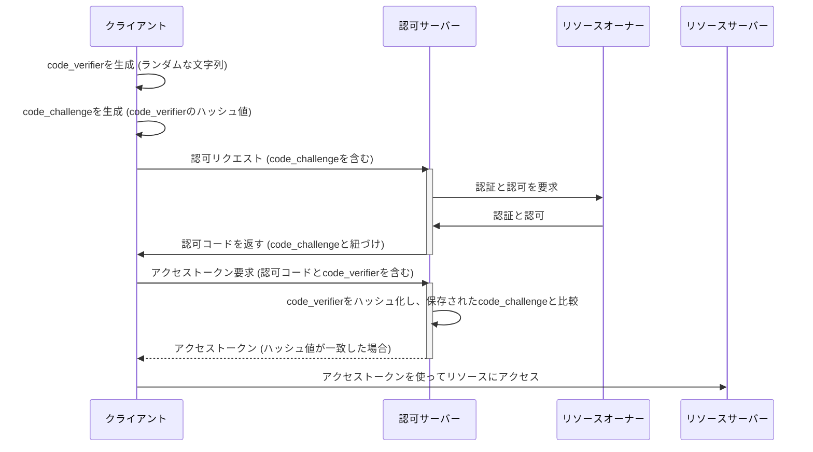
---

# PKCE によって認可コード横取り攻撃を防ぐことができる理由

悪意のあるアプリは`code_verifier`を特定できないため、横取りはできてもアクセストークンを発行できない。

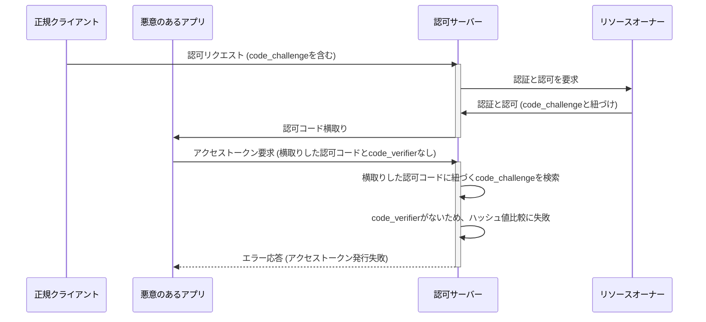


---

# 3. state パラメータの使用

- state
  - クライアントが認可リクエストを開始する際に生成するランダムな文字列で、リダイレクト URI を介してクライアントに返送される。
  - クライアントアプリ側で認可リクエスト時に生成した値をキャッシュしておき、リダイレクト時に認可サーバからの戻りとの一致を確認する

---

# state を検証しない場合

攻撃者の作った認可リクエストを踏まされて、不正にアクセストークンを取得される

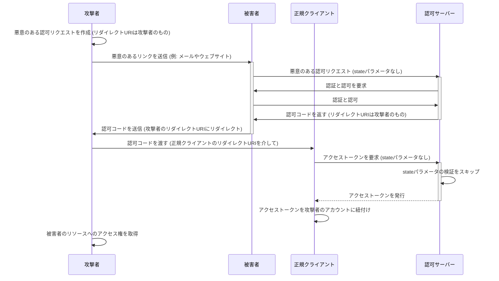

---

# state を検証する認可コードグラントフロー

クライアントアプリは state を発行して認可リクエストのパラメータとして付与する。リダイレクト時にキャッシュした state とリダイレクトのパラメータの state を検証する

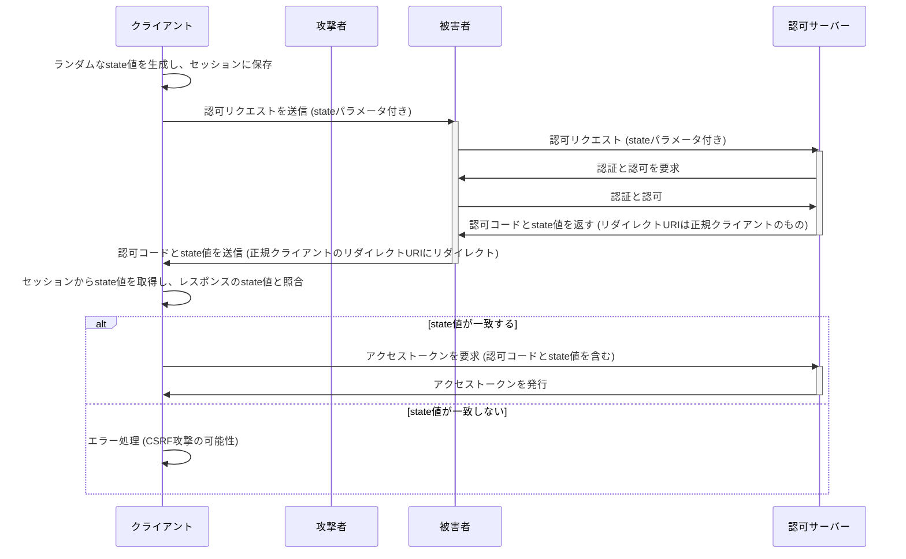

---

# state の検証が CSRF を防ぐ理由

悪意のあるアプリはクライアントアプリが生成する state がわからないため、クライアントアプリが必ずトークンを発行せずエラーとする。

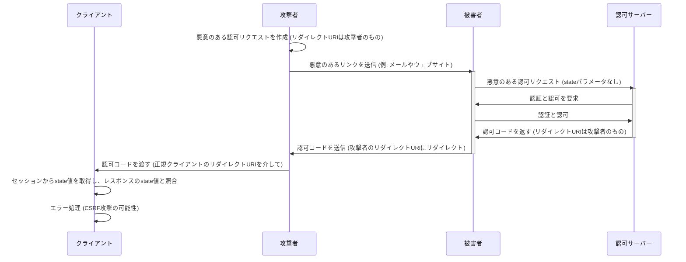

---

# トークンの再発行、検証、取り消し

- トークンの再発行
  - アクセストークン発行時に共に返却される`refresh_token`を利用してアクセストークンを再発行することができる
- トークンの検証
  - イントロスペクションエンドポイントなどへのリクエストを通してアクセストークンのメタデータ(トークンの有効期限、スコープ、関連付けられたクライアントなど)を取得できる
- トークンの失効
  - アクセストークンが漏洩した場合や、利用者の許可を取り消す場合など、トークンを無効化したい場合は、リヴォケーションエンドポイントへのリクエストによって無効化する

---

# アジェンダ

1. 認可と認証
2. OAuth 2.0
3. **OpenID Connect (OIDC)**
4. OAuth 2.0 と OIDC の応用

---

# OpenID Connect (OIDC)

---

# 参考文献

- [RFC6749](https://openid-foundation-japan.github.io/rfc6749.ja.html)
- [OpenID Connect Core 1.0 incorporating errata set 1](https://openid-foundation-japan.github.io/openid-connect-core-1_0.ja.html)
- [一番分かりやすい OAuth の説明](https://qiita.com/TakahikoKawasaki/items/e37caf50776e00e733be)
- [一番分かりやすい OpenID Connect の説明](https://qiita.com/TakahikoKawasaki/items/498ca08bbfcc341691fe)
- [PKCE: 認可コード横取り攻撃対策のために OAuth サーバーとクライアントが実装すべきこと](https://qiita.com/TakahikoKawasaki/items/00f333c72ed96c4da659)
- [OAuth/OIDC をまとめてみる(下書き段階です！)](https://zenn.dev/calloc134/articles/5e8da6c491e720)
