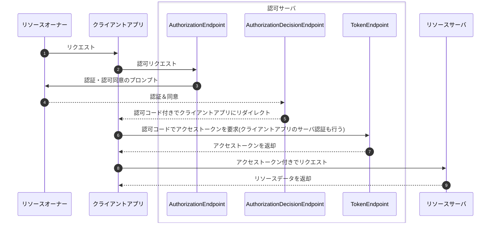
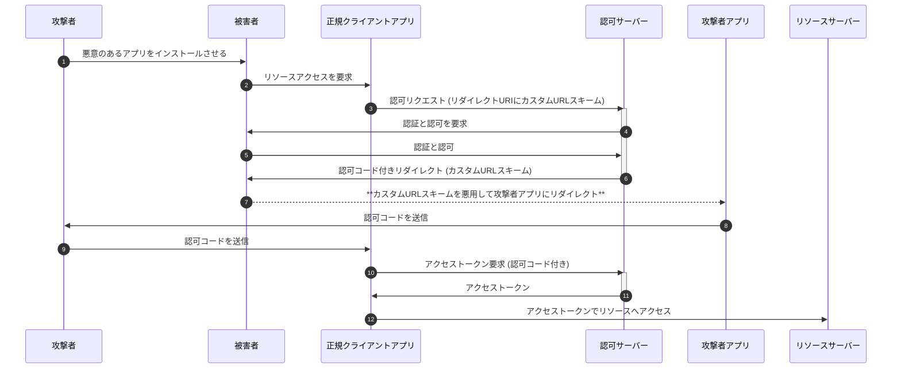
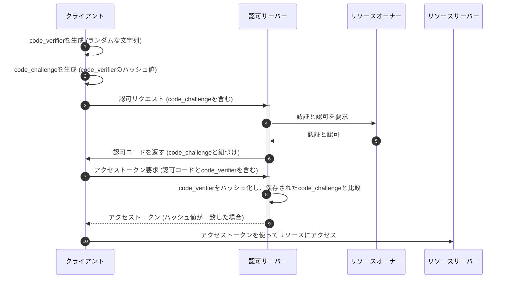
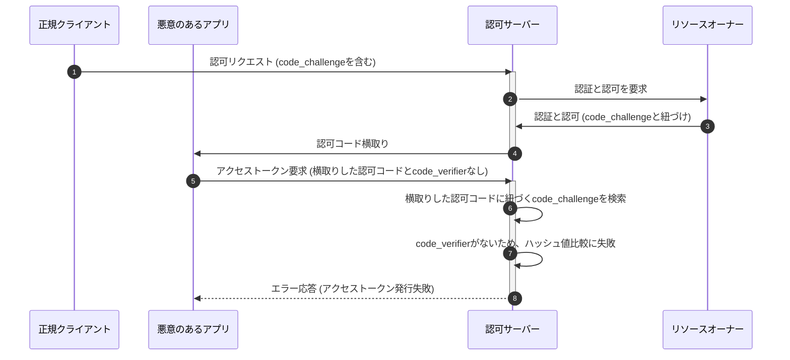
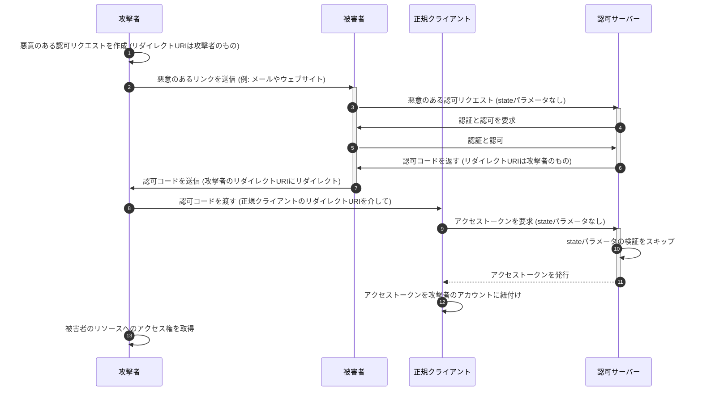
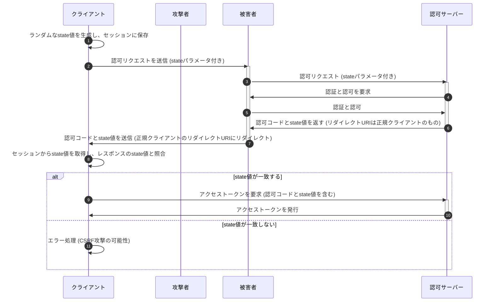
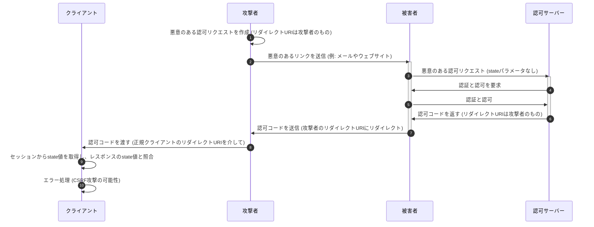
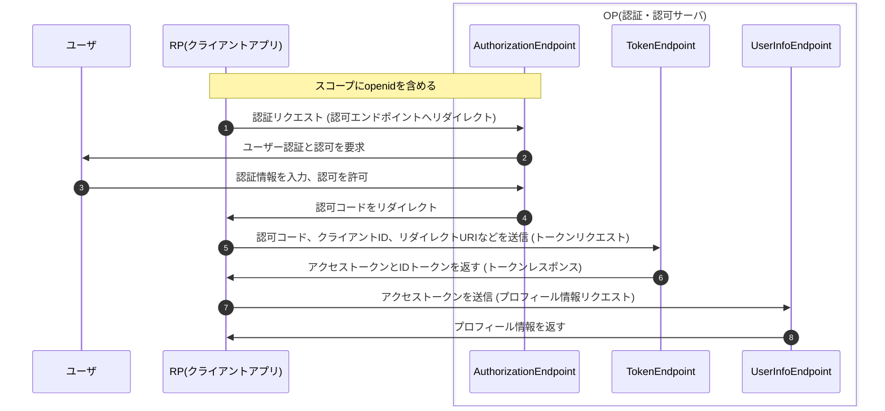
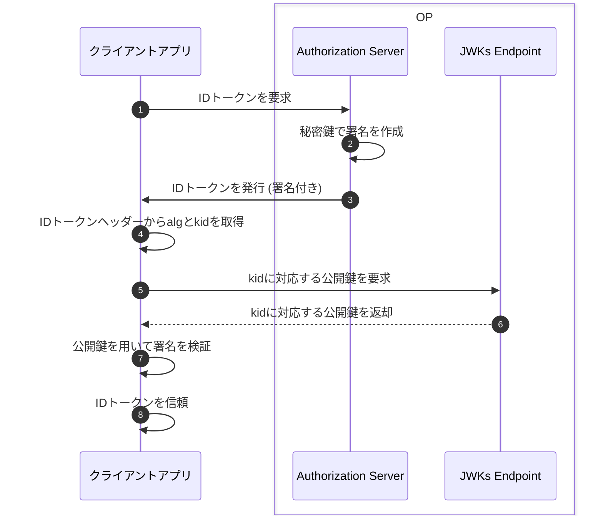

# OAuth2.0/OIDC 概説

---

# アジェンダ

1. 認可と認証
2. OAuth 2.0
3. OpenID Connect (OIDC)
4. OAuth 2.0とOIDCの応用

---

# アジェンダ

1. **認可と認証**
2. OAuth 2.0
3. OpenID Connect (OIDC)
4. OAuth 2.0とOIDCの応用

---

# 1. 認可と認証

- **認証** と **認可** の違いについて
- 従来の認証方式における課題

---

# **認証** と **認可** の違いについて

- 認証(Authentication)
  - ユーザーの身元を確認すること（私は～～である）
- 認可(Authorization)
  - ユーザーにリソースへアクセスする許可を与えること（～～をしてよい）

---

# OAuth2.0/OIDC の文脈に寄せた具体例

- 認証(Authentication)
  - ～～ としてログインする
- 認可(Authorization)
  - ～～ の代わりに「写真を閲覧してもよい」「写真をアップロードしてよい」「写真を削除してよい」

---

# 従来の認証方式における課題

1. パスワードの共有
   - 第三者サービスを利用するために、ユーザーは自分のパスワードをそのサービスに提供する必要があった
2. 各サービスごとに認証が必要
   - 多くのウェブサイトやサービスで、ユーザーは個別にアカウントを作成し、パスワードを管理する必要があった

---

# 従来の認証方式

従来認証方式ではクライアントがサーバに向けてID/Passwordを入力しユーザのデータにアクセス。


---

# パスワードの共有

そのため、3rdパーティのアプリがユーザのデータにアクセスするためには、ID/Password（に類する情報）を共有する必要。


---

# 各サービスごとに認証が必要

また、サービスごとにIDが管理されているため、ユーザは複数のIDを管理する必要があった。


---

# アジェンダ

1. 認可と認証
2. **OAuth 2.0**
3. OpenID Connect (OIDC)
4. OAuth 2.0とOIDCの応用

---

# OAuth 2.0

**OAuth 2.0** =
リソース所有者が自身の所有するリソースへのアクセス権を第三者アプリケーションに安全に委任するための認可フレームワーク。\
様々な仕様がRFCなどに定義されている。

---

# OAuth 2.0

1. OAuth 2.0の基本的な概念と登場人物（リソースオーナー、リソースサーバー、クライアントアプリ、認可サーバー）
2. OAuth 2.0のプロトコルフロー
3. OAuth 2.0が従来の認証方式の抱える課題を如何に解決したか
4. OAuth 2.0実際のリクエスト例
5. OAuth 2.0とセキュリティ（インプリシットフロー非推奨、PKCE、state検証）
6. トークンの再発行、検証、取り消し

---

# OAuth 2.0 の基本的な概念と登場人物

ここからはOAuthの仕様を解説していくので用語を整理。.。

- アクセストークン： 保護されたリソースにアクセスするための鍵
- リソースオーナー: リソースの所有者（例： Google Photoのユーザー）
- クライアントアプリ：
  リソースにアクセスしたい第三者アプリケーション（認可サーバ目線だとクライアント）
- リソースサーバー: リソースを保管しているサーバー
- 認可サーバー:アクセストークンを発行するサーバー
- 認可グラント：アクセストークンを取得するための方法
- スコープ： リソースへのアクセス範囲

---

# OAuth 2.0 の基本的な概念と登場人物

図にするとこんな感じ。


事前に認可サーバへのリクエストを通じて「クライアントアプリに特定の操作を許可する」というフローを追加した。

---

# OAuth 2.0 のプロトコルフロー

OAuth 2.0のフローには複数あるが[*]、代表的なAuthorization Code
Grantフロー（認可コードグラントフロー）について解説する。



[*]: https://qiita.com/TakahikoKawasaki/items/200951e5b5929f840a1f

---

# OAuth 2.0 が従来の認証方式の抱える課題を如何に解決したか

パスワードをクライアントアプリに共有する必要がなくなった。\
= パスワードではなくアクセストークンを3rdパーティのアプリは利用する。

> 保護されたリソースにアクセスする為にリソースオーナーのクレデンシャルを使う代わりに,クライアントはアクセストークンを取得する.
> **アクセストークンとは,ある特定のスコープ,期間およびその他のアクセス権に関する情報を示す文字列**である.[**]

[**]: https://openid-foundation-japan.github.io/rfc6749.ja.html

---

# OAuth 2.0 実際のリクエスト例

実際のリクエスト例を見てみる（GoogleDriveを利用する場合[***]）。

[***]: https://developers.google.com/identity/protocols/oauth2/web-server?hl=ja#httprest

---

# 認可リクエスト

以下のURLにアクセスすることで認証・認可画面が表示され、ユーザに認証とリクエストする権限への同意（=認可）を得ることができる。

```
https://accounts.google.com/o/oauth2/v2/auth?
 scope=https%3A//www.googleapis.com/auth/drive.metadata.readonly%20https%3A//www.googleapis.com/auth/calendar.readonly&
 access_type=offline&
 include_granted_scopes=true&
 response_type=code&
 state=state_parameter_passthrough_value&
 redirect_uri=https%3A//oauth2.example.com/code&
 client_id=1234567
```

---

# 認可の結果の返却

ユーザが同意する場合、しない場合、認証に失敗した場合のいずれの場合もクライアントアプリにリダイレクトする。
クエリパラメータに成否を表す値が付与される。

## 認可した場合

```
https://oauth2.example.com/auth?code=4/P7q7W91a-oMsCeLvIaQm6bTrgtp7
```

## 認可しなかった場合

```
https://oauth2.example.com/auth?error=access_denied
```

---

# アクセストークン発行

クライアントアプリは認可コードを持ってアクセストークンを要求する。

```
POST /token HTTP/1.1
Host: oauth2.googleapis.com
Content-Type: application/x-www-form-urlencoded

code=4/P7q7W91a-oMsCeLvIaQm6bTrgtp7&
client_id=your_client_id&
client_secret=your_client_secret&
redirect_uri=https%3A//oauth2.example.com/code&
grant_type=authorization_code
```

---

# アクセストークンの返却

正常なリクエストの場合、以下のレスポンスを得る。

```json
{
  "access_token": "1/fFAGRNJru1FTz70BzhT3Zg",
  "expires_in": 3920,
  "token_type": "Bearer",
  "scope": "https://www.googleapis.com/auth/drive.metadata.readonly https://www.googleapis.com/auth/calendar.readonly",
  "refresh_token": "1//xEoDL4iW3cxlI7yDbSRFYNG01kVKM2C-259HOF2aQbI"
}
```

---

# OAuth 2.0 とセキュリティ

1. インプリシットフローの回避
2. PKCE (Proof Key for Code Exchange) の導入
3. stateの検証

---

# 1. インプリシットフローの回避

OAuth2.0の複数のプロトコルフローのうちインプリシットフローは非推奨とされている
(**OAuth2.0 Security Best Current Practice** や **OAuth 2.1**)。
インプリシットフローは認可コードではなくアクセストークンをリダイレクトを通じて直接クライアントアプリが受け取るフローであり、以下の観点から脆弱性が指摘されている。

- アクセストークンの漏洩：アクセストークンがブラウザの履歴やHTTPリファラーヘッダーに残るため、漏洩のリスクが高い。
- アクセストークンのリプレイ攻撃：漏洩したアクセストークンが悪意のある第三者によって使用される可能性がある。
- トークン置換攻撃への脆弱性：Implicitフローでは、認可サーバーはクライアントを認証しないため、トークン置換攻撃に対して脆弱である。

---

# 2. PKCE (Proof Key for Code Exchange) の導入

PKCEは、認可コード横取り攻撃を防止するためのセキュリティ機構。\
特に**PublicClient**で認可コードグラントフローを使用する場合には、PKCEの導入が必須。\
PKCEを使用することで、悪意のある第三者アプリケーションが認可コードを盗み出してアクセストークンを取得することを防ぐことができる。

---

# クライアントタイプ

PublicClientではクライアント認証しない。

- Confidential Client: クライアントシークレットを安全に管理できるクライアント
- Public Client:
  SPAやネイティブアプリなどクライアントシークレットを安全に管理できないクライアント

---

# ネイティブアプリで認可コードを横取りされるシーケンス



※カスタムURLスキーム： ネイティブのアプリをURL形式で指定する。複数のアプリ間でユニークで**なく**てよい。

---

# PKCE(Proof Key for Code Exchange)

code_verifierとcode_challengeによって、パブリッククライアントでも疑似的にクライアント認証する。

- code_verifier
  - クライアントアプリで都度生成するランダムな文字列
- code_challenge
  - code_verifierのハッシュ（SHA-265推奨）。**ハッシュなので code_challenge から code_verifier を復元することが難しい**。

---

# PKCE を導入した認可コードグラントフロー



---

# PKCE によって認可コード横取り攻撃を防ぐことができる理由

悪意のあるアプリは`code_verifier`を特定できないため、横取りはできてもアクセストークンを発行できない。



---

# 3. state パラメータの使用

- state
  - クライアントが認可リクエストを開始する際に生成するランダムな文字列で、リダイレクトURIを介してクライアントに返送される。
  - クライアントアプリ側で認可リクエスト時に生成した値をキャッシュしておき、リダイレクト時に認可サーバからの戻りとの一致を確認する。

---

# state を検証しない場合

攻撃者の作った認可リクエストを踏まされて、不正にアクセストークンを取得される。



---

# state を検証する認可コードグラントフロー

クライアントアプリはstateを発行して認可リクエストのパラメータとして付与する。リダイレクト時にキャッシュしたstateとリダイレクトのパラメータのstateを検証する。



---

# state の検証が CSRF を防ぐ理由

悪意のあるアプリはクライアントアプリが生成するstateをわからないため、クライアントアプリが必ずトークンを発行せずエラーとする。



---

# トークンの再発行、検証、取り消し

- トークンの再発行
  - アクセストークン発行時に共に返却される`refresh_token`を利用してアクセストークンを再発行できる。
- トークンの検証
  - イントロスペクションエンドポイントなどへのリクエストを通してアクセストークンのメタデータ（トークンの有効期限、スコープ、関連付けられたクライアントなど）を取得できる。
- トークンの失効
  - アクセストークンが漏洩した場合や、利用者の許可を取り消す場合など、トークンを無効化したい場合は、リヴォケーションエンドポイントへのリクエストによって無効化する。

---

# アジェンダ

1. 認可と認証
2. OAuth 2.0
3. **OpenID Connect (OIDC)**
4. OAuth 2.0とOIDCの応用

---

# OpenID Connect (OIDC)

OAuth 2.0が便利なので認証にも使いたいということで、OAuth 2.0を拡張して認証のためのアイデンティティレイヤーを提供するもの。

1. そもそもなぜOAuth 2.0で認証をやってはいけないのか
2. OpenID Connectの基本用語
3. OpenID Connectのフロー
4. IDトークンの構造とクレーム
5. UserInfoエンドポイント
6. OpenID Connectが従来の認証方式の抱える課題を如何に解決したか

---

# そもそもなぜOAuth 2.0で認証をやってはいけないのか

プロフィールに関する権限を認可すれば、「認可 + プロフィールAPI」によって認証機能は実現できそうだが。.。

認証に関する仕様が定まっていないため、認可サーバごとの仕様差異やセキュリティリスクなどが付きまとう。  
→認証機能を実現するためにOAuth2.0ではカバーできない仕様を標準化した`OpenID Connect`が誕生。

---

# OpenID Connect の基本用語

- IDトークン： ユーザーの認証結果とプロフィール情報を表現するトークン
- リライングパーティ (RP): クライアントアプリケーション
  - OAuth2.0のクライアントアプリ
- OpenIDプロバイダー (OP): 認証サーバー
  - OAuth2.0の認可サーバ
- UserInfoエンドポイント： ユーザーのプロフィール情報を提供するエンドポイント

---

# OpenID Connectのフロー

OAuth2.0の認可エンドポイントには必須パラメータとして`response_type`があるが、OIDCではこの仕様を拡張した。

- OAuth2.0
  - `code`か`token`の**いずれか**の値を取る
- OIDC
  - `code`、`token`、`id_token`の**任意の組み合わせ** + `none`

---

したがってOIDCでは、以下のパターンの`response_type`を取りうることになる。

- code
- token
- id_token
- id_token token
- code id_token
- code token
- code id_token token
- none

また、IDトークンの発行を受けるためには`scope`に`openid`を含める必要がある。

`response_type`を適切に指定することで、認可エンドポイントやトークンエンドポイントからIDトークンを得ることができる。\
全フローの解説については[こちら](https://qiita.com/TakahikoKawasaki/items/4ee9b55db9f7ef352b47)を参照のこと。

---

# OpenID Connectのフロー

OAuth2.0のアクセストークンの発行と同時にIDトークンを発行することも可能。以下は認可コードグラントフローの場合。



---

# ID トークンの構造とクレーム

JSON Web Signature (JWS)の仕様に基づいた文字列のこと。以下が具体例。\
※見やすさのために改行を入れているだけで本来は改行なし。

```
eyJraWQiOiIxZTlnZGs3IiwiYWxnIjoiUlMyNTYifQ.ewogImlz
cyI6ICJodHRwOi8vc2VydmVyLmV4YW1wbGUuY29tIiwKICJzdWIiOiAiMjQ4
Mjg5NzYxMDAxIiwKICJhdWQiOiAiczZCaGRSa3F0MyIsCiAibm9uY2UiOiAi
bi0wUzZfV3pBMk1qIiwKICJleHAiOiAxMzExMjgxOTcwLAogImlhdCI6IDEz
MTEyODA5NzAsCiAibmFtZSI6ICJKYW5lIERvZSIsCiAiZ2l2ZW5fbmFtZSI6
ICJKYW5lIiwKICJmYW1pbHlfbmFtZSI6ICJEb2UiLAogImdlbmRlciI6ICJm
ZW1hbGUiLAogImJpcnRoZGF0ZSI6ICIwMDAwLTEwLTMxIiwKICJlbWFpbCI6
ICJqYW5lZG9lQGV4YW1wbGUuY29tIiwKICJwaWN0dXJlIjogImh0dHA6Ly9l
eGFtcGxlLmNvbS9qYW5lZG9lL21lLmpwZyIKfQ.rHQjEmBqn9Jre0OLykYNn
spA10Qql2rvx4FsD00jwlB0Sym4NzpgvPKsDjn_wMkHxcp6CilPcoKrWHcip
R2iAjzLvDNAReF97zoJqq880ZD1bwY82JDauCXELVR9O6_B0w3K-E7yM2mac
AAgNCUwtik6SjoSUZRcf-O5lygIyLENx882p6MtmwaL1hd6qn5RZOQ0TLrOY
u0532g9Exxcm-ChymrB4xLykpDj3lUivJt63eEGGN6DH5K6o33TcxkIjNrCD
4XB1CKKumZvCedgHHF3IAK4dVEDSUoGlH9z4pP_eWYNXvqQOjGs-rDaQzUHl
6cQQWNiDpWOl_lxXjQEvQ
```

---

# ID トークンの構造とクレーム

IDトークンはピリオド区切りで3つの部分からなる。

**ヘッダー.ペイロード.署名**

先の例だと以下の通り。

**ヘッダー**

```
eyJraWQiOiIxZTlnZGs3IiwiYWxnIjoiUlMyNTYifQ
```

---

**ペイロード**

```
ewogImlz
cyI6ICJodHRwOi8vc2VydmVyLmV4YW1wbGUuY29tIiwKICJzdWIiOiAiMjQ4
Mjg5NzYxMDAxIiwKICJhdWQiOiAiczZCaGRSa3F0MyIsCiAibm9uY2UiOiAi
bi0wUzZfV3pBMk1qIiwKICJleHAiOiAxMzExMjgxOTcwLAogImlhdCI6IDEz
MTEyODA5NzAsCiAibmFtZSI6ICJKYW5lIERvZSIsCiAiZ2l2ZW5fbmFtZSI6
ICJKYW5lIiwKICJmYW1pbHlfbmFtZSI6ICJEb2UiLAogImdlbmRlciI6ICJm
ZW1hbGUiLAogImJpcnRoZGF0ZSI6ICIwMDAwLTEwLTMxIiwKICJlbWFpbCI6
ICJqYW5lZG9lQGV4YW1wbGUuY29tIiwKICJwaWN0dXJlIjogImh0dHA6Ly9l
eGFtcGxlLmNvbS9qYW5lZG9lL21lLmpwZyIKfQ
```

**署名**

```
rHQjEmBqn9Jre0OLykYNn
spA10Qql2rvx4FsD00jwlB0Sym4NzpgvPKsDjn_wMkHxcp6CilPcoKrWHcip
R2iAjzLvDNAReF97zoJqq880ZD1bwY82JDauCXELVR9O6_B0w3K-E7yM2mac
AAgNCUwtik6SjoSUZRcf-O5lygIyLENx882p6MtmwaL1hd6qn5RZOQ0TLrOY
u0532g9Exxcm-ChymrB4xLykpDj3lUivJt63eEGGN6DH5K6o33TcxkIjNrCD
4XB1CKKumZvCedgHHF3IAK4dVEDSUoGlH9z4pP_eWYNXvqQOjGs-rDaQzUHl
6cQQWNiDpWOl_lxXjQEvQ
```

となる。

---

# ID トークンの構造とクレーム

ヘッダー、ペイロード、署名のそれぞれに含まれる情報配下の通り。

- ヘッダー (Header): JWTのタイプや署名アルゴリズムなどの情報
- ペイロード (Payload): 認証に関する情報（クレーム）
- 署名 (Signature): トークンの改ざんを検知するための情報

---

# ID トークンの構造とクレーム

**ヘッダー.ペイロード.署名**という3つのパーツに分ける形式がJWSに定義される**Compact Serialization 形式**。\
具体的には以下のように定義されている。

> BASE64URL(UTF8(JWS Protected Header)) || '.' || \
> BASE64URL(JWS Payload) || '.' || \
> BASE64URL(JWS Signature)

つまり、Base64エンコードされている（デコードすることで元の情報を得られる）ということ。

---

# ID トークンの構造とクレーム

## ヘッダーのデコード

```sh
echo -n 'eyJraWQiOiIxZTlnZGs3IiwiYWxnIjoiUlMyNTYifQ==' |  base64 -di # paddingのため==を追加
```

```json
{ "kid": "1e9gdk7", "alg": "RS256" }
```

JSON形式でkidとalgというパラメータが含まれていることが分かる。

---

ヘッダーは具体的には以下のパラメータを持ちうる。

| パラメーター名 |      説明      |
| :------------: | :------------: |
|      alg       |  アルゴリズム  |
|      jku       | JWK セット URL |
|      jwk       | JSON Web キー  |
|      kid       |    キー ID     |
|      x5u       |   X.509 URL    |

---

| パラメーター名 |              説明               |
| :------------: | :-----------------------------: |
|      x5c       |      X.509 証明書チェーン       |
|      x5t       |  X.509 証明書 SHA-1 Thumbprint  |
|    x5t#S256    | X.509 証明書 SHA-256 Thumbprint |
|      typ       |    JWS 自身のメディアタイプ     |
|      cty       |   ペイロードのメディアタイプ    |
|      crit      |     必須パラメーター群指定      |

---

# ID トークンの構造とクレーム

## ペイロードのデコード

```sh
echo -n 'ewogImlzcyI6ICJodHRwOi8vc2VydmVyLmV4YW1wbGUuY29tIiwKICJzdWIiOiAiMjQ4 \
Mjg5NzYxMDAxIiwKICJhdWQiOiAiczZCaGRSa3F0MyIsCiAibm9uY2UiOiAi \
bi0wUzZfV3pBMk1qIiwKICJleHAiOiAxMzExMjgxOTcwLAogImlhdCI6IDEz \
MTEyODA5NzAsCiAibmFtZSI6ICJKYW5lIERvZSIsCiAiZ2l2ZW5fbmFtZSI6 \
ICJKYW5lIiwKICJmYW1pbHlfbmFtZSI6ICJEb2UiLAogImdlbmRlciI6ICJm \
ZW1hbGUiLAogImJpcnRoZGF0ZSI6ICIwMDAwLTEwLTMxIiwKICJlbWFpbCI6 \
ICJqYW5lZG9lQGV4YW1wbGUuY29tIiwKICJwaWN0dXJlIjogImh0dHA6Ly9l \
eGFtcGxlLmNvbS9qYW5lZG9lL21lLmpwZyIKfQ==' |  base64 -di
```

---

```json
{
  "iss": "http://server.example.com",
  "sub": "248289761001",
  "aud": "s6BhdRkqt3",
  "nonce": "n-0S6_WzA2Mj",
  "exp": 1311281970,
  "iat": 1311280970,
  "name": "Jane Doe",
  "given_name": "Jane",
  "family_name": "Doe",
  "gender": "female",
  "birthdate": "0000-10-31",
  "email": "janedoe@example.com",
  "picture": "http://example.com/janedoe/me.jpg"
}
```

上記のようにユーザ情報などが得られていることがわかる（詳細は後述）。

---

# ID トークンの構造とクレーム

## 署名のデコード

署名は、トークンの改ざんがされていないことを確認するための情報。 \
デコードすると以下のバイナリが得られる。

```sh
echo -n 'rHQjEmBqn9Jre0OLykYNn \
spA10Qql2rvx4FsD00jwlB0Sym4NzpgvPKsDjn_wMkHxcp6CilPcoKrWHcip \
R2iAjzLvDNAReF97zoJqq880ZD1bwY82JDauCXELVR9O6_B0w3K-E7yM2mac \
AAgNCUwtik6SjoSUZRcf-O5lygIyLENx882p6MtmwaL1hd6qn5RZOQ0TLrOY \
u0532g9Exxcm-ChymrB4xLykpDj3lUivJt63eEGGN6DH5K6o33TcxkIjNrCD \
4XB1CKKumZvCedgHHF3IAK4dVEDSUoGlH9z4pP_eWYNXvqQOjGs-rDaQzUHl \
6cQQWNiDpWOl_lxXjQEvQ==' \
| base64 -di \
| od -tu1 -An
```

---

```
 172 116  35  18  96 106 159 210 107 123  67 139 202  70  13 158
 202  64 215  68  42 151 106 239 199 129 108  15  77  35 194  80
 116  75  41 184  55  58  96 188 242 172  14  57 240  50  65 241
 114 158 130 138  83 220 160 170 214  29 200 169  71 104 128 143
  50 239  12 208  17 120  95 123 206 130 106 171 207  52 100  61
  91 193 143  54  36  54 174   9 113  11  85  31  78 232  29  48
 220 161  59 200 205 166 105 192   0 128 208 148 194 216 164 233
  40 232  73  70  81 113 243 185 151  40   8 200 177  13 199 207
  54 167 163  45 155   6 139 214  23 122 170 126  81 100 228  52
  76 186 206  98 237  57 223 104  61  19  28  92 152  40 114 154
 176 120 196 188 164 164  56 247 149  72 175  38 222 183 120  65
 134  55 160 199 228 174 168 223 116 220 198  66  35  54 176 131
 225 112 117   8 162 174 153 155 194 121 216   7  28  93 200   0
 174  29  84  64 210  82 129 165  31 220 248 164 247 150  96 213
 239 169   3 163  26 202 195 105  12 212  30  94 156  65   5 141
 136  58  86  58  89 113  94  52   4 189
```

---

# ID トークンの構造とクレーム

## 署名検証

署名は**ヘッダーとペイロード**を入力情報に作成される。今までの例だと以下が入力情報。

```
eyJraWQiOiIxZTlnZGs3IiwiYWxnIjoiUlMyNTYifQ.ewogImlz
cyI6ICJodHRwOi8vc2VydmVyLmV4YW1wbGUuY29tIiwKICJzdWIiOiAiMjQ4
Mjg5NzYxMDAxIiwKICJhdWQiOiAiczZCaGRSa3F0MyIsCiAibm9uY2UiOiAi
bi0wUzZfV3pBMk1qIiwKICJleHAiOiAxMzExMjgxOTcwLAogImlhdCI6IDEz
MTEyODA5NzAsCiAibmFtZSI6ICJKYW5lIERvZSIsCiAiZ2l2ZW5fbmFtZSI6
ICJKYW5lIiwKICJmYW1pbHlfbmFtZSI6ICJEb2UiLAogImdlbmRlciI6ICJm
ZW1hbGUiLAogImJpcnRoZGF0ZSI6ICIwMDAwLTEwLTMxIiwKICJlbWFpbCI6
ICJqYW5lZG9lQGV4YW1wbGUuY29tIiwKICJwaWN0dXJlIjogImh0dHA6Ly9l
eGFtcGxlLmNvbS9qYW5lZG9lL21lLmpwZyIKfQ
```

ヘッダーで指定されたアルゴリズム（上記の場合RS256）に基づいて「ヘッダーとペイロード」を暗号化したバイナリをbase64エンコードしていた。

---

# ID トークンの構造とクレーム

## 署名検証

例えば、RS256の場合、以下のようなシーケンスで署名検証を行う。\
**JWKs Endpoint**は暗号鍵を扱うエンドポイント。暗号鍵をJSON形式で扱う[JWK](https://datatracker.ietf.org/doc/html/rfc7517)も参照のこと。



---

# ID トークンの構造とクレーム

## ペイロードのクレーム

JWT（JSON形式で表現されたクレーム（claim）の集合）がペイロードに埋め込まれている。

以下は先のdecode例。

```json
{
  "iss": "http://server.example.com",
  "sub": "248289761001",
  "aud": "s6BhdRkqt3",
  "nonce": "n-0S6_WzA2Mj",
  "exp": 1311281970,
  "iat": 1311280970,
  "name": "Jane Doe",
  "given_name": "Jane",
  "family_name": "Doe",
  "gender": "female",
  "birthdate": "0000-10-31",
  "email": "janedoe@example.com",
  "picture": "http://example.com/janedoe/me.jpg"
}
```

---

# ID トークンの構造とクレーム

## ペイロードのクレーム

[JWTの仕様](https://datatracker.ietf.org/doc/html/rfc7519)では、以下のクレームが定義されている。\
OIDCでは、そのうち、`iss`, `sub`, `aud`, `exp`, `iat`を必須としている（JWTの仕様では全て任意）。

| クレーム名 |                     説明                     |
| :--------: | :------------------------------------------: |
|    iss     | JWT の発行者 (issuer) を識別するための識別子 |
|    sub     |             ユーザーの一意識別子             |
|    aud     |              Audience クレーム               |

---

| クレーム名 |                         説明                          |
| :--------: | :---------------------------------------------------: |
|    exp     |   JWT の有効期限。Unix エポック からの経過**秒**数    |
|    nbf     |                  Not Before クレーム                  |
|    iat     | JWT が発行された日時。Unix エポックからの経過**秒**数 |
|    jti     |                    JWT ID クレーム                    |

---

# ID トークンの構造とクレーム

## ペイロードのクレーム

加えてJWTとは別でOIDCの仕様として定義されるクレームも存在する。

| クレーム名 |                                     説明                                     |
| :--------: | :--------------------------------------------------------------------------: |
| auth_time  |          ユーザーが認証された時刻。Unix エポックからの経過**秒**数           |
|   nonce    | リプレイアタック防止のためのパラメータ。リクエストされた値をそのまま埋め込む |
|    acr     |                ユーザー認証が満たした認証コンテキストのクラス                |
|    amr     |                      認証手法。利用者が規則決めて運用。                      |
|    azp     |              認可された対象者(認可されたクライアントアプリのID)              |

---

# ID トークンの構造とクレーム

## ペイロードのクレーム

ユーザ情報を表すクレームもOIDCにて定義されている。

| クレーム名  |         説明         |
| :---------: | :------------------: |
|     sub     | ユーザーの一意識別子 |
|    name     |      フルネーム      |
| given_name  |          名          |
| family_name |          姓          |
| middle_name |     ミドルネーム     |
|  nickname   |     ニックネーム     |

---

|     クレーム名     |                  説明                  |
| :----------------: | :------------------------------------: |
| preferred_username |            好みのユーザー名            |
|      profile       |        プロフィールページの URL        |
|      picture       |         プロフィール画像の URL         |
|      website       |        Web サイトやブログの URL        |
|       email        |             メールアドレス             |
|   email_verified   | メールアドレスが検証済みか否かの真偽値 |
|       gender       |   性別。female と male が定義済み。    |
|     birthdate      |    誕生日。YYYY-MM-DD という書式。     |
|      zoneinfo      |   タイムゾーン。Europe/Paris など。    |

---

|      クレーム名       |                     説明                      |
| :-------------------: | :-------------------------------------------: |
|        locale         |            ロケール。en-US など。             |
|     phone_number      |                   電話番号                    |
| phone_number_verified |       電話番号が検証済みか否かの真偽値        |
|        address        | 住所。書式は「5.1.1. Address Claim」に記載。  |
|      updated_at       | 最終更新日。Unix エポックからの経過**秒**数。 |

---

# ID トークンの構造とクレーム

## ペイロードのクレーム

アクセストークンの発行を同時に行うときには以下のクレームを追加する。

| クレーム名 |                                        説明                                         |
| :--------: | :---------------------------------------------------------------------------------: |
|  at_hash   | アクセストークンのハッシュのうち、左半分のビット群を base64url でエンコードしたもの |
|   c_hash   |   認可コードのハッシュのうち、 左半分のビット群を base64url でエンコードしたもの    |

また、`nonce`が必須となる。

---

# UserInfoエンドポイント

アクセストークンで保護されるエンドポイントの1つとして、IDトークン相当の情報を得るためのエンドポイントの仕様がOIDCでは定義されている。\
JWT形式またはJSON形式で返却する。

---

# OpenID Connectが従来の認証方式の抱える課題を如何に解決したか

- ユーザ目線：アプリケーションごとにIDを管理する必要がなくなった
  - GoogleのID/Passを覚えておけば、Qiitaを使うことができる
- アプリ目線：認証の事実（いつ、だれが、どのような方法で、いつまで有効か）やユーザ属性情報を標準的に取り扱うことができるようになった

---

# アジェンダ

1. 認可と認証
2. OAuth 2.0
3. OpenID Connect (OIDC)
4. **OAuth 2.0とOIDCの応用**

---

# 参考文献

- [RFC6749](https://openid-foundation-japan.github.io/rfc6749.ja.html)
- [OpenID Connect Core 1.0 incorporating errata set 1](https://openid-foundation-japan.github.io/openid-connect-core-1_0.ja.html)
- [一番分かりやすい OAuth の説明](https://qiita.com/TakahikoKawasaki/items/e37caf50776e00e733be)
- [一番分かりやすい OpenID Connect の説明](https://qiita.com/TakahikoKawasaki/items/498ca08bbfcc341691fe)
- [PKCE: 認可コード横取り攻撃対策のために OAuth サーバーとクライアントが実装すべきこと](https://qiita.com/TakahikoKawasaki/items/00f333c72ed96c4da659)
- [OAuth/OIDC をまとめてみる(下書き段階です！)](https://zenn.dev/calloc134/articles/5e8da6c491e720)
